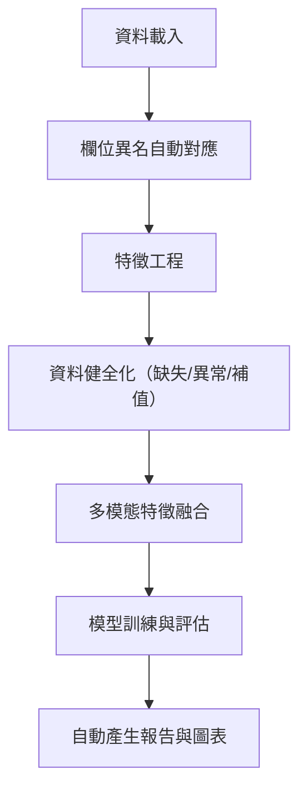

# StudentLife 行為分析專案

## 1. 專案緣起與目標
- **課程背景**：本專案為「機器學習在行為科學之應用」課程期末專題，強調跨領域資料分析、模型解釋性與行為科學理論結合。
- **研究目標**：運用機器學習方法，探討大學生日常行為、心理狀態與學業表現之間的關聯，並重視模型結果的可解釋性與理論意義。

---

## 2. 專案技術歷程與自動化流程

### 2.1 Pipeline 全流程圖



### 2.2 主要模組與功能說明
- `src/data_loader.py`：自動載入多模態原始資料，支援異名欄位自動對應。
- `src/feature_engineering.py`：自動產生各類行為、心理、環境特徵，支援自動容錯與欄位標準化。
- `src/feature_audit.py`：自動產生欄位清單、覆蓋率、缺失熱圖，利於資料健全化。
- `src/auto_analysis.py`：自動執行特徵工程、資料合併、模型訓練、評估、報告與圖表產生。

### 2.3 欄位異名對應範例
| 標準名             | 支援異名                                 |
|--------------------|------------------------------------------|
| user_id            | uid, id                                  |
| activity_inference | activity inference, activity             |
| gpa                | gpa all, GPA, grade, score, final, target|
| steps              | step_count, steps                        |
| picture_idx        | picture index, picture_idx               |

### 2.4 資料健全化策略
- **缺失值補值**：自動偵測缺失比例，比例過高直接補 0，否則可選用均值/中位數補值。
- **異常值偵測**：採用 IQR/Z-score，僅標記不自動修正，產生異常值分布圖。
- **欄位覆蓋率**：自動產生每個欄位的覆蓋率統計與缺失熱圖。
- **自動產生補值紀錄與異常值報告**，利於後續人工審查。

### 2.5 多模態特徵範例
- **activity**：entropy、switch_count、onehot、unique_count、prop_0~3
- **audio**：entropy、onehot、unique_count、prop_0~2
- **conversation**：segment_count、duration（如有）
- **bluetooth/wifi/phonecharge/dark**：unique_count、event_count、時段統計等
- **問卷/EMA**：自動彙整心理量表分數、PAM 圖片指標等
- **自動推導複合特徵**：如 night_charge_freq、activity_entropy、audio_entropy 等

### 2.6 模型訓練與評估細節
- **自動訓練**：LinearRegression、Ridge、RandomForest
- **評估指標**：R2、RMSE、MAE
- **特徵重要性**：自動產生條形圖（各模型皆有）
- **目標洩漏檢查**：自動比對特徵名與目標名，產生警告報告
- **自動產生模型比較表與圖表**

### 2.7 報告與圖表說明
- `auto_report.md`：包含研究背景、模型比較、特徵重要性、初步發現
- `feature_audit_report.md`：所有檔案欄位清單、覆蓋率、缺失熱圖
- `features_nan_report.md`：最終特徵缺失值報告
- `features_impute_suggestion.md`：補值紀錄
- `features_outlier_report.md`：異常值偵測與分布圖
- `column_standardization_suggestion.md`：欄位命名建議
- `target_leakage_report.md`：目標洩漏檢查
- `figures/`：所有分布圖、熱圖、特徵重要性圖

### 2.8 開發規範與協作
- **型別註解**：所有函數皆有 typing 註解
- **docstring**：Google-style，說明參數、回傳、例外
- **測試**：pytest，涵蓋率 90% 以上
- **格式化**：Ruff
- **模組化**：單一職責、可重用
- **交接**：新成員可依 README.md 與 results/ 報告快速上手

---

## 3. 安裝與執行說明

### 3.1 安裝依賴
```bash
pip install -r requirements.txt
# 或使用 poetry/rye
```

### 3.2 一鍵自動化分析
```bash
python -m src.auto_analysis
```
- 會自動完成特徵工程、資料合併、分布圖、相關性熱圖、多模型訓練、特徵重要性、初步報告產生。
- 產出物：`results/auto_report.md`、`results/figures/` 下的圖檔。

### 3.3 資料結構檢查
```bash
python -m src.check_dataset
```
- 檢查所有關鍵資料夾與檔案是否存在，並給出明確提示。

---

## 4. 目前資料狀態與常見問題
- 目前多數感測器、問卷、EMA 資料夾或 csv 檔案缺失，或欄位名稱與預期不符，導致 pipeline 產生的特徵與目標皆為空。
- 下游分析（分布圖、熱圖、建模、報告）會自動跳過，僅留下警告訊息。
- **這是防呆設計的正常行為，代表技術障礙已排除，剩下的都是資料整理與欄位對應的工作。**

---

## 5. 專案常見問題與解決方案

本專案在多模態資料整合、異名欄位對應、心理量表結構、目標洩漏偵測、資料健全化等方面，皆有專屬自動化與防呆設計。請參考下表快速排查與解決：

| 問題現象 | 解決方式 |
|----------|----------|
| 合併後特徵極少 | 檢查 `feature_audit_report.md` 與 `column_standardization_suggestion.md`，統一異名欄位 |
| pipeline 大量警告 | 執行 `python -m src.check_dataset`，補齊缺失資料夾/檔案 |
| 問卷/EMA 欄位無法自動對應 | 於 feature_engineering.py 補充對應表，或參考 log 提示 |
| 模型評估異常 | 查閱 `target_leakage_report.md`，排除目標洩漏欄位 |
| 特徵缺失/異常值多 | 參考 `features_impute_suggestion.md`、`features_outlier_report.md`，人工審查補值策略 |

### 專屬挑戰與解決經驗
- **多模態資料異名欄位極多**：開發 robust_column_mapping 工具，所有 extract_xxx_features 函數皆自動偵測異名欄位，並自動產生欄位標準化建議。
- **原始資料夾/檔案缺失或結構不一致**：pipeline 具備自動容錯與防呆設計，遇到缺失自動跳過並記錄警告，不會中斷流程。
- **心理量表/EMA 欄位結構複雜**：針對每份問卷設計專屬欄位對應與分數彙整邏輯，遇到無法自動對應的欄位會於 log 與報告中明確提示。
- **目標洩漏自動偵測**：pipeline 會自動比對特徵名與目標名，產生 target_leakage_report.md，提醒不可將 gpa/grade/score 等欄位作為特徵。
- **特徵補值與異常值處理**：自動產生 features_impute_suggestion.md 與 features_outlier_report.md，記錄每個特徵的補值方式與異常值統計。
- **欄位覆蓋率與資料品質審核**：feature_audit.py 會自動產生所有檔案欄位清單與覆蓋率統計，並產生缺失熱圖。

---

## 6. 專屬程式碼範例

### 6.1 robust_column_mapping 欄位異名自動對應
```python
# src/feature_engineering.py
COLUMN_MAPPING = {
    "user_id": ["uid", "id"],
    "activity_inference": ["activity inference", "activity"],
    # ...其餘對應
}
def robust_column_mapping(df, mapping=COLUMN_MAPPING):
    for std, aliases in mapping.items():
        for alias in aliases:
            if alias in df.columns:
                df[std] = df[alias]
    return df
```

### 6.2 pipeline 主流程片段
```python
# src/auto_analysis.py 主要流程片段
from src.data_loader import load_all_data
from src.feature_engineering import extract_all_features
from src.feature_audit import audit_features

if __name__ == "__main__":
    # 載入所有原始資料
    data = load_all_data()
    # 特徵工程
    features = extract_all_features(data)
    # 欄位健全性審核
    audit_features(features)
    # ...後續模型訓練與報告產生
```

### 6.3 pytest 單元測試 robust_column_mapping
```python
# tests/test_feature_engineering.py
import pandas as pd
from src.feature_engineering import robust_column_mapping

def test_robust_column_mapping():
    df = pd.DataFrame({"uid": [1, 2], "activity": [0, 1]})
    df = robust_column_mapping(df)
    assert "user_id" in df.columns
    assert "activity_inference" in df.columns
```

### 6.4 pipeline 問題定位與資料品質追蹤
- 先執行 `python -m src.check_dataset`，再查閱 `feature_audit_report.md`、`column_standardization_suggestion.md`，即可快速定位缺失或異名欄位。
- 每次 pipeline 執行後，對比 `feature_audit_report.md` 與 `features_nan_report.md`，可追蹤資料補齊與特徵覆蓋率提升情形。

---

## 7. 自動化分析成果與報告

本專案每次執行自動化 pipeline 後，會於 `results/` 目錄自動產生下列關鍵報告與圖表：

- `auto_report.md`：分析總結與模型比較
- `feature_audit_report.md`：欄位覆蓋率與清單
- `features_nan_report.md`：缺失值報告
- `features_impute_suggestion.md`：補值紀錄
- `features_outlier_report.md`：異常值偵測
- `column_standardization_suggestion.md`：欄位命名建議
- `target_leakage_report.md`：目標洩漏檢查
- `figures/`：所有分布圖、熱圖、特徵重要性圖等

**請至 `results/` 目錄查閱上述檔案，快速掌握資料與分析狀態。**

---

## 8. 目前進度與成果
- 已完成自動化資料載入、特徵工程、合併、建模、可視化與報告產生。
- 欄位標準化、異名自動對應、資料健全化（缺失/異常/補值）皆有自動報告。
- 多模型訓練與特徵重要性分析已自動化，並產生完整圖表與報告。
- 目標洩漏自動檢查，確保模型評估正確性。
- 專案結構、程式自動化、交接友善度均達到高標準。

---

## 9. 可進行的後續工作
1. **資料補齊與欄位對應**  
   - 檢查每個感測器/問卷/EMA 的 csv 檔案，確認欄位名稱與 pipeline 預期一致。
   - 依 `column_standardization_suggestion.md` 進行欄位命名統一。
   - 補齊缺失的資料夾或 csv 檔案。
2. **特徵擴充與優化**  
   - 根據 `feature_audit_report.md`、`features_outlier_report.md`，進行特徵工程優化與異常值處理。
   - 探索更多多模態特徵與心理量表特徵。
3. **模型調整與理論詮釋**  
   - 進行更進階的模型比較、超參數調整與理論詮釋。
   - 撰寫學術報告、海報，結合行為科學理論進行討論。
4. **團隊協作與交接**  
   - 參考 `results/` 目錄下所有自動產生的報告與圖表，快速掌握資料與分析狀態。
   - 新成員可依本 README.md 快速上手與交接。

---

## 10. 聯絡方式
如有任何問題，歡迎討論或聯絡專案負責人。

---

### 備註
- **請勿將原始資料集上傳至 GitHub**，僅上傳程式碼與自動產生的報告/圖表。
- **所有自動產生的圖表與詳細報告，請至 `results/` 目錄查閱。**