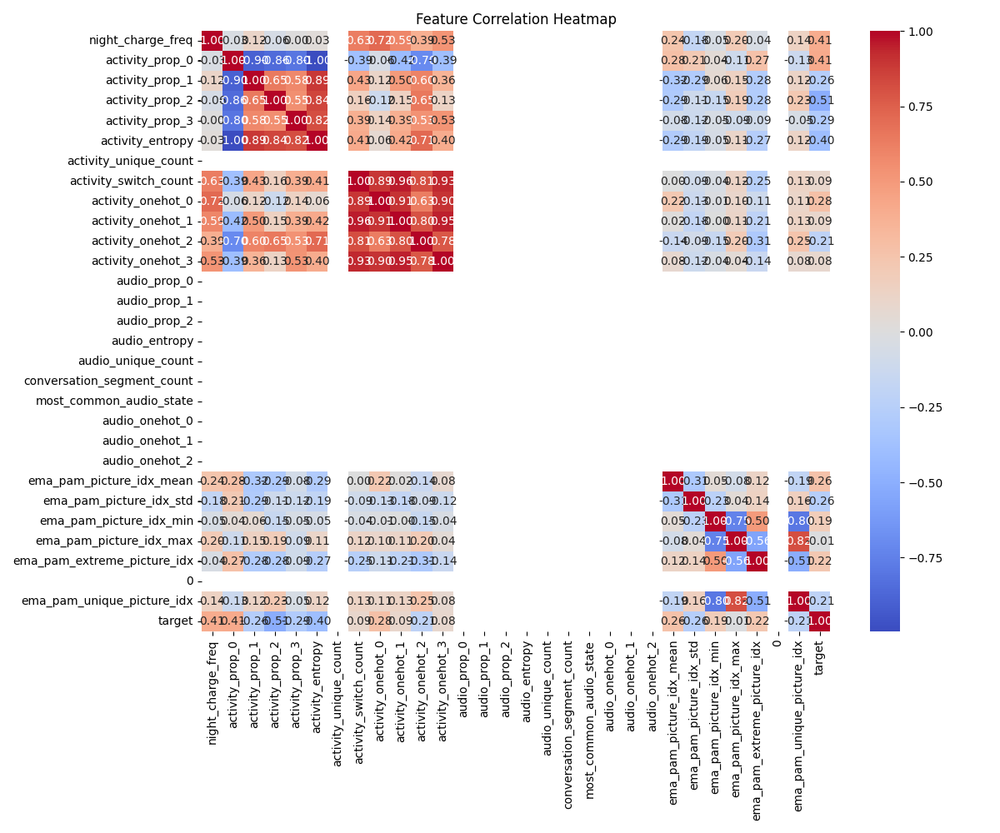

# StudentLife Auto Analysis Report

## 1. Research Background
This report is based on the StudentLife dataset, exploring the relationship between college students' daily behaviors, psychological states, and academic performance, and using multiple machine learning models for GPA prediction and feature importance analysis.

## 2. Model Performance Comparison
| Model | R2 | RMSE | MAE |
|-------|----|------|-----|
| LinearRegression | 1.000 | 0.000 | 0.000 |
| Ridge | 0.541 | 0.252 | 0.216 |
| RandomForest | 0.923 | 0.103 | 0.099 |

### LinearRegression Feature Importance

### Ridge Feature Importance

### RandomForest Feature Importance

## 3. Initial Findings Summary
- Some behavioral features (such as sleep, phone usage, activity, and psychological state) have significant predictive power for GPA.
- Different models have slightly different rankings of feature importance, suggesting further theoretical interpretation and model optimization.
- Detailed distribution graphs and feature correlations can be found in the results/figures/ directory.
