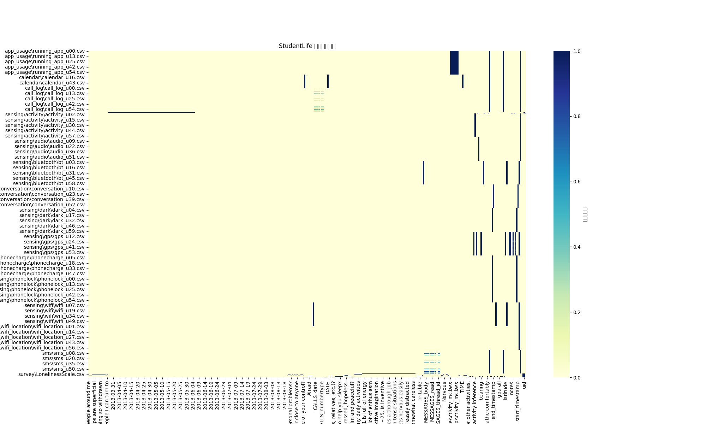

# StudentLife 欄位覆蓋率與欄位清單報告

## 所有檔案欄位清單
- **app_usage\running_app_u00.csv**: id, device, timestamp, RUNNING_TASKS_baseActivity_mClass, RUNNING_TASKS_baseActivity_mPackage, RUNNING_TASKS_id, RUNNING_TASKS_numActivities, RUNNING_TASKS_numRunning, RUNNING_TASKS_topActivity_mClass, RUNNING_TASKS_topActivity_mPackage
- **app_usage\running_app_u01.csv**: id, device, timestamp, RUNNING_TASKS_baseActivity_mClass, RUNNING_TASKS_baseActivity_mPackage, RUNNING_TASKS_id, RUNNING_TASKS_numActivities, RUNNING_TASKS_numRunning, RUNNING_TASKS_topActivity_mClass, RUNNING_TASKS_topActivity_mPackage
- **app_usage\running_app_u02.csv**: id, device, timestamp, RUNNING_TASKS_baseActivity_mClass, RUNNING_TASKS_baseActivity_mPackage, RUNNING_TASKS_id, RUNNING_TASKS_numActivities, RUNNING_TASKS_numRunning, RUNNING_TASKS_topActivity_mClass, RUNNING_TASKS_topActivity_mPackage
- **app_usage\running_app_u03.csv**: id, device, timestamp, RUNNING_TASKS_baseActivity_mClass, RUNNING_TASKS_baseActivity_mPackage, RUNNING_TASKS_id, RUNNING_TASKS_numActivities, RUNNING_TASKS_numRunning, RUNNING_TASKS_topActivity_mClass, RUNNING_TASKS_topActivity_mPackage
- **app_usage\running_app_u04.csv**: id, device, timestamp, RUNNING_TASKS_baseActivity_mClass, RUNNING_TASKS_baseActivity_mPackage, RUNNING_TASKS_id, RUNNING_TASKS_numActivities, RUNNING_TASKS_numRunning, RUNNING_TASKS_topActivity_mClass, RUNNING_TASKS_topActivity_mPackage
- **app_usage\running_app_u05.csv**: id, device, timestamp, RUNNING_TASKS_baseActivity_mClass, RUNNING_TASKS_baseActivity_mPackage, RUNNING_TASKS_id, RUNNING_TASKS_numActivities, RUNNING_TASKS_numRunning, RUNNING_TASKS_topActivity_mClass, RUNNING_TASKS_topActivity_mPackage
- **app_usage\running_app_u07.csv**: id, device, timestamp, RUNNING_TASKS_baseActivity_mClass, RUNNING_TASKS_baseActivity_mPackage, RUNNING_TASKS_id, RUNNING_TASKS_numActivities, RUNNING_TASKS_numRunning, RUNNING_TASKS_topActivity_mClass, RUNNING_TASKS_topActivity_mPackage
- **app_usage\running_app_u08.csv**: id, device, timestamp, RUNNING_TASKS_baseActivity_mClass, RUNNING_TASKS_baseActivity_mPackage, RUNNING_TASKS_id, RUNNING_TASKS_numActivities, RUNNING_TASKS_numRunning, RUNNING_TASKS_topActivity_mClass, RUNNING_TASKS_topActivity_mPackage
- **app_usage\running_app_u09.csv**: id, device, timestamp, RUNNING_TASKS_baseActivity_mClass, RUNNING_TASKS_baseActivity_mPackage, RUNNING_TASKS_id, RUNNING_TASKS_numActivities, RUNNING_TASKS_numRunning, RUNNING_TASKS_topActivity_mClass, RUNNING_TASKS_topActivity_mPackage
- **app_usage\running_app_u10.csv**: id, device, timestamp, RUNNING_TASKS_baseActivity_mClass, RUNNING_TASKS_baseActivity_mPackage, RUNNING_TASKS_id, RUNNING_TASKS_numActivities, RUNNING_TASKS_numRunning, RUNNING_TASKS_topActivity_mClass, RUNNING_TASKS_topActivity_mPackage
- **app_usage\running_app_u12.csv**: id, device, timestamp, RUNNING_TASKS_baseActivity_mClass, RUNNING_TASKS_baseActivity_mPackage, RUNNING_TASKS_id, RUNNING_TASKS_numActivities, RUNNING_TASKS_numRunning, RUNNING_TASKS_topActivity_mClass, RUNNING_TASKS_topActivity_mPackage
- **app_usage\running_app_u13.csv**: id, device, timestamp, RUNNING_TASKS_baseActivity_mClass, RUNNING_TASKS_baseActivity_mPackage, RUNNING_TASKS_id, RUNNING_TASKS_numActivities, RUNNING_TASKS_numRunning, RUNNING_TASKS_topActivity_mClass, RUNNING_TASKS_topActivity_mPackage
- **app_usage\running_app_u14.csv**: id, device, timestamp, RUNNING_TASKS_baseActivity_mClass, RUNNING_TASKS_baseActivity_mPackage, RUNNING_TASKS_id, RUNNING_TASKS_numActivities, RUNNING_TASKS_numRunning, RUNNING_TASKS_topActivity_mClass, RUNNING_TASKS_topActivity_mPackage
- **app_usage\running_app_u15.csv**: id, device, timestamp, RUNNING_TASKS_baseActivity_mClass, RUNNING_TASKS_baseActivity_mPackage, RUNNING_TASKS_id, RUNNING_TASKS_numActivities, RUNNING_TASKS_numRunning, RUNNING_TASKS_topActivity_mClass, RUNNING_TASKS_topActivity_mPackage
- **app_usage\running_app_u16.csv**: id, device, timestamp, RUNNING_TASKS_baseActivity_mClass, RUNNING_TASKS_baseActivity_mPackage, RUNNING_TASKS_id, RUNNING_TASKS_numActivities, RUNNING_TASKS_numRunning, RUNNING_TASKS_topActivity_mClass, RUNNING_TASKS_topActivity_mPackage
- **app_usage\running_app_u17.csv**: id, device, timestamp, RUNNING_TASKS_baseActivity_mClass, RUNNING_TASKS_baseActivity_mPackage, RUNNING_TASKS_id, RUNNING_TASKS_numActivities, RUNNING_TASKS_numRunning, RUNNING_TASKS_topActivity_mClass, RUNNING_TASKS_topActivity_mPackage
- **app_usage\running_app_u18.csv**: id, device, timestamp, RUNNING_TASKS_baseActivity_mClass, RUNNING_TASKS_baseActivity_mPackage, RUNNING_TASKS_id, RUNNING_TASKS_numActivities, RUNNING_TASKS_numRunning, RUNNING_TASKS_topActivity_mClass, RUNNING_TASKS_topActivity_mPackage
- **app_usage\running_app_u19.csv**: id, device, timestamp, RUNNING_TASKS_baseActivity_mClass, RUNNING_TASKS_baseActivity_mPackage, RUNNING_TASKS_id, RUNNING_TASKS_numActivities, RUNNING_TASKS_numRunning, RUNNING_TASKS_topActivity_mClass, RUNNING_TASKS_topActivity_mPackage
- **app_usage\running_app_u20.csv**: id, device, timestamp, RUNNING_TASKS_baseActivity_mClass, RUNNING_TASKS_baseActivity_mPackage, RUNNING_TASKS_id, RUNNING_TASKS_numActivities, RUNNING_TASKS_numRunning, RUNNING_TASKS_topActivity_mClass, RUNNING_TASKS_topActivity_mPackage
- **app_usage\running_app_u22.csv**: id, device, timestamp, RUNNING_TASKS_baseActivity_mClass, RUNNING_TASKS_baseActivity_mPackage, RUNNING_TASKS_id, RUNNING_TASKS_numActivities, RUNNING_TASKS_numRunning, RUNNING_TASKS_topActivity_mClass, RUNNING_TASKS_topActivity_mPackage
- **app_usage\running_app_u23.csv**: id, device, timestamp, RUNNING_TASKS_baseActivity_mClass, RUNNING_TASKS_baseActivity_mPackage, RUNNING_TASKS_id, RUNNING_TASKS_numActivities, RUNNING_TASKS_numRunning, RUNNING_TASKS_topActivity_mClass, RUNNING_TASKS_topActivity_mPackage
- **app_usage\running_app_u24.csv**: id, device, timestamp, RUNNING_TASKS_baseActivity_mClass, RUNNING_TASKS_baseActivity_mPackage, RUNNING_TASKS_id, RUNNING_TASKS_numActivities, RUNNING_TASKS_numRunning, RUNNING_TASKS_topActivity_mClass, RUNNING_TASKS_topActivity_mPackage
- **app_usage\running_app_u25.csv**: id, device, timestamp, RUNNING_TASKS_baseActivity_mClass, RUNNING_TASKS_baseActivity_mPackage, RUNNING_TASKS_id, RUNNING_TASKS_numActivities, RUNNING_TASKS_numRunning, RUNNING_TASKS_topActivity_mClass, RUNNING_TASKS_topActivity_mPackage
- **app_usage\running_app_u27.csv**: id, device, timestamp, RUNNING_TASKS_baseActivity_mClass, RUNNING_TASKS_baseActivity_mPackage, RUNNING_TASKS_id, RUNNING_TASKS_numActivities, RUNNING_TASKS_numRunning, RUNNING_TASKS_topActivity_mClass, RUNNING_TASKS_topActivity_mPackage
- **app_usage\running_app_u30.csv**: id, device, timestamp, RUNNING_TASKS_baseActivity_mClass, RUNNING_TASKS_baseActivity_mPackage, RUNNING_TASKS_id, RUNNING_TASKS_numActivities, RUNNING_TASKS_numRunning, RUNNING_TASKS_topActivity_mClass, RUNNING_TASKS_topActivity_mPackage
- **app_usage\running_app_u31.csv**: id, device, timestamp, RUNNING_TASKS_baseActivity_mClass, RUNNING_TASKS_baseActivity_mPackage, RUNNING_TASKS_id, RUNNING_TASKS_numActivities, RUNNING_TASKS_numRunning, RUNNING_TASKS_topActivity_mClass, RUNNING_TASKS_topActivity_mPackage
- **app_usage\running_app_u32.csv**: id, device, timestamp, RUNNING_TASKS_baseActivity_mClass, RUNNING_TASKS_baseActivity_mPackage, RUNNING_TASKS_id, RUNNING_TASKS_numActivities, RUNNING_TASKS_numRunning, RUNNING_TASKS_topActivity_mClass, RUNNING_TASKS_topActivity_mPackage
- **app_usage\running_app_u33.csv**: id, device, timestamp, RUNNING_TASKS_baseActivity_mClass, RUNNING_TASKS_baseActivity_mPackage, RUNNING_TASKS_id, RUNNING_TASKS_numActivities, RUNNING_TASKS_numRunning, RUNNING_TASKS_topActivity_mClass, RUNNING_TASKS_topActivity_mPackage
- **app_usage\running_app_u34.csv**: id, device, timestamp, RUNNING_TASKS_baseActivity_mClass, RUNNING_TASKS_baseActivity_mPackage, RUNNING_TASKS_id, RUNNING_TASKS_numActivities, RUNNING_TASKS_numRunning, RUNNING_TASKS_topActivity_mClass, RUNNING_TASKS_topActivity_mPackage
- **app_usage\running_app_u35.csv**: id, device, timestamp, RUNNING_TASKS_baseActivity_mClass, RUNNING_TASKS_baseActivity_mPackage, RUNNING_TASKS_id, RUNNING_TASKS_numActivities, RUNNING_TASKS_numRunning, RUNNING_TASKS_topActivity_mClass, RUNNING_TASKS_topActivity_mPackage
- **app_usage\running_app_u36.csv**: id, device, timestamp, RUNNING_TASKS_baseActivity_mClass, RUNNING_TASKS_baseActivity_mPackage, RUNNING_TASKS_id, RUNNING_TASKS_numActivities, RUNNING_TASKS_numRunning, RUNNING_TASKS_topActivity_mClass, RUNNING_TASKS_topActivity_mPackage
- **app_usage\running_app_u39.csv**: id, device, timestamp, RUNNING_TASKS_baseActivity_mClass, RUNNING_TASKS_baseActivity_mPackage, RUNNING_TASKS_id, RUNNING_TASKS_numActivities, RUNNING_TASKS_numRunning, RUNNING_TASKS_topActivity_mClass, RUNNING_TASKS_topActivity_mPackage
- **app_usage\running_app_u41.csv**: id, device, timestamp, RUNNING_TASKS_baseActivity_mClass, RUNNING_TASKS_baseActivity_mPackage, RUNNING_TASKS_id, RUNNING_TASKS_numActivities, RUNNING_TASKS_numRunning, RUNNING_TASKS_topActivity_mClass, RUNNING_TASKS_topActivity_mPackage
- **app_usage\running_app_u42.csv**: id, device, timestamp, RUNNING_TASKS_baseActivity_mClass, RUNNING_TASKS_baseActivity_mPackage, RUNNING_TASKS_id, RUNNING_TASKS_numActivities, RUNNING_TASKS_numRunning, RUNNING_TASKS_topActivity_mClass, RUNNING_TASKS_topActivity_mPackage
- **app_usage\running_app_u43.csv**: id, device, timestamp, RUNNING_TASKS_baseActivity_mClass, RUNNING_TASKS_baseActivity_mPackage, RUNNING_TASKS_id, RUNNING_TASKS_numActivities, RUNNING_TASKS_numRunning, RUNNING_TASKS_topActivity_mClass, RUNNING_TASKS_topActivity_mPackage
- **app_usage\running_app_u44.csv**: id, device, timestamp, RUNNING_TASKS_baseActivity_mClass, RUNNING_TASKS_baseActivity_mPackage, RUNNING_TASKS_id, RUNNING_TASKS_numActivities, RUNNING_TASKS_numRunning, RUNNING_TASKS_topActivity_mClass, RUNNING_TASKS_topActivity_mPackage
- **app_usage\running_app_u45.csv**: id, device, timestamp, RUNNING_TASKS_baseActivity_mClass, RUNNING_TASKS_baseActivity_mPackage, RUNNING_TASKS_id, RUNNING_TASKS_numActivities, RUNNING_TASKS_numRunning, RUNNING_TASKS_topActivity_mClass, RUNNING_TASKS_topActivity_mPackage
- **app_usage\running_app_u46.csv**: id, device, timestamp, RUNNING_TASKS_baseActivity_mClass, RUNNING_TASKS_baseActivity_mPackage, RUNNING_TASKS_id, RUNNING_TASKS_numActivities, RUNNING_TASKS_numRunning, RUNNING_TASKS_topActivity_mClass, RUNNING_TASKS_topActivity_mPackage
- **app_usage\running_app_u47.csv**: id, device, timestamp, RUNNING_TASKS_baseActivity_mClass, RUNNING_TASKS_baseActivity_mPackage, RUNNING_TASKS_id, RUNNING_TASKS_numActivities, RUNNING_TASKS_numRunning, RUNNING_TASKS_topActivity_mClass, RUNNING_TASKS_topActivity_mPackage
- **app_usage\running_app_u49.csv**: id, device, timestamp, RUNNING_TASKS_baseActivity_mClass, RUNNING_TASKS_baseActivity_mPackage, RUNNING_TASKS_id, RUNNING_TASKS_numActivities, RUNNING_TASKS_numRunning, RUNNING_TASKS_topActivity_mClass, RUNNING_TASKS_topActivity_mPackage
- **app_usage\running_app_u50.csv**: id, device, timestamp, RUNNING_TASKS_baseActivity_mClass, RUNNING_TASKS_baseActivity_mPackage, RUNNING_TASKS_id, RUNNING_TASKS_numActivities, RUNNING_TASKS_numRunning, RUNNING_TASKS_topActivity_mClass, RUNNING_TASKS_topActivity_mPackage
- **app_usage\running_app_u51.csv**: id, device, timestamp, RUNNING_TASKS_baseActivity_mClass, RUNNING_TASKS_baseActivity_mPackage, RUNNING_TASKS_id, RUNNING_TASKS_numActivities, RUNNING_TASKS_numRunning, RUNNING_TASKS_topActivity_mClass, RUNNING_TASKS_topActivity_mPackage
- **app_usage\running_app_u52.csv**: id, device, timestamp, RUNNING_TASKS_baseActivity_mClass, RUNNING_TASKS_baseActivity_mPackage, RUNNING_TASKS_id, RUNNING_TASKS_numActivities, RUNNING_TASKS_numRunning, RUNNING_TASKS_topActivity_mClass, RUNNING_TASKS_topActivity_mPackage
- **app_usage\running_app_u53.csv**: id, device, timestamp, RUNNING_TASKS_baseActivity_mClass, RUNNING_TASKS_baseActivity_mPackage, RUNNING_TASKS_id, RUNNING_TASKS_numActivities, RUNNING_TASKS_numRunning, RUNNING_TASKS_topActivity_mClass, RUNNING_TASKS_topActivity_mPackage
- **app_usage\running_app_u54.csv**: id, device, timestamp, RUNNING_TASKS_baseActivity_mClass, RUNNING_TASKS_baseActivity_mPackage, RUNNING_TASKS_id, RUNNING_TASKS_numActivities, RUNNING_TASKS_numRunning, RUNNING_TASKS_topActivity_mClass, RUNNING_TASKS_topActivity_mPackage
- **app_usage\running_app_u56.csv**: id, device, timestamp, RUNNING_TASKS_baseActivity_mClass, RUNNING_TASKS_baseActivity_mPackage, RUNNING_TASKS_id, RUNNING_TASKS_numActivities, RUNNING_TASKS_numRunning, RUNNING_TASKS_topActivity_mClass, RUNNING_TASKS_topActivity_mPackage
- **app_usage\running_app_u57.csv**: id, device, timestamp, RUNNING_TASKS_baseActivity_mClass, RUNNING_TASKS_baseActivity_mPackage, RUNNING_TASKS_id, RUNNING_TASKS_numActivities, RUNNING_TASKS_numRunning, RUNNING_TASKS_topActivity_mClass, RUNNING_TASKS_topActivity_mPackage
- **app_usage\running_app_u58.csv**: id, device, timestamp, RUNNING_TASKS_baseActivity_mClass, RUNNING_TASKS_baseActivity_mPackage, RUNNING_TASKS_id, RUNNING_TASKS_numActivities, RUNNING_TASKS_numRunning, RUNNING_TASKS_topActivity_mClass, RUNNING_TASKS_topActivity_mPackage
- **app_usage\running_app_u59.csv**: id, device, timestamp, RUNNING_TASKS_baseActivity_mClass, RUNNING_TASKS_baseActivity_mPackage, RUNNING_TASKS_id, RUNNING_TASKS_numActivities, RUNNING_TASKS_numRunning, RUNNING_TASKS_topActivity_mClass, RUNNING_TASKS_topActivity_mPackage
- **calendar\calendar_u00.csv**: id, device, timestamp, ACCOUNT_LABEL, DATE, TIME
- **calendar\calendar_u01.csv**: id, device, timestamp, ACCOUNT_LABEL, DATE, TIME
- **calendar\calendar_u02.csv**: id, device, timestamp, ACCOUNT_LABEL, DATE, TIME
- **calendar\calendar_u08.csv**: id, device, timestamp, ACCOUNT_LABEL, DATE, TIME
- **calendar\calendar_u12.csv**: id, device, timestamp, ACCOUNT_LABEL, DATE, TIME
- **calendar\calendar_u13.csv**: id, device, timestamp, ACCOUNT_LABEL, DATE, TIME
- **calendar\calendar_u16.csv**: id, device, timestamp, ACCOUNT_LABEL, DATE, TIME
- **calendar\calendar_u18.csv**: id, device, timestamp, ACCOUNT_LABEL, DATE, TIME
- **calendar\calendar_u19.csv**: id, device, timestamp, ACCOUNT_LABEL, DATE, TIME
- **calendar\calendar_u20.csv**: id, device, timestamp, ACCOUNT_LABEL, DATE, TIME
- **calendar\calendar_u22.csv**: id, device, timestamp, ACCOUNT_LABEL, DATE, TIME
- **calendar\calendar_u24.csv**: id, device, timestamp, ACCOUNT_LABEL, DATE, TIME
- **calendar\calendar_u30.csv**: id, device, timestamp, ACCOUNT_LABEL, DATE, TIME
- **calendar\calendar_u31.csv**: id, device, timestamp, ACCOUNT_LABEL, DATE, TIME
- **calendar\calendar_u32.csv**: id, device, timestamp, ACCOUNT_LABEL, DATE, TIME
- **calendar\calendar_u33.csv**: id, device, timestamp, ACCOUNT_LABEL, DATE, TIME
- **calendar\calendar_u41.csv**: id, device, timestamp, ACCOUNT_LABEL, DATE, TIME
- **calendar\calendar_u43.csv**: id, device, timestamp, ACCOUNT_LABEL, DATE, TIME
- **calendar\calendar_u46.csv**: id, device, timestamp, ACCOUNT_LABEL, DATE, TIME
- **calendar\calendar_u49.csv**: id, device, timestamp, ACCOUNT_LABEL, DATE, TIME
- **calendar\calendar_u50.csv**: id, device, timestamp, ACCOUNT_LABEL, DATE, TIME
- **calendar\calendar_u52.csv**: id, device, timestamp, ACCOUNT_LABEL, DATE, TIME
- **calendar\calendar_u53.csv**: id, device, timestamp, ACCOUNT_LABEL, DATE, TIME
- **calendar\calendar_u54.csv**: id, device, timestamp, ACCOUNT_LABEL, DATE, TIME
- **calendar\calendar_u56.csv**: id, device, timestamp, ACCOUNT_LABEL, DATE, TIME
- **calendar\calendar_u57.csv**: id, device, timestamp, ACCOUNT_LABEL, DATE, TIME
- **calendar\calendar_u58.csv**: id, device, timestamp, ACCOUNT_LABEL, DATE, TIME
- **calendar\calendar_u59.csv**: id, device, timestamp, ACCOUNT_LABEL, DATE, TIME
- **call_log\call_log_u00.csv**: id, device, timestamp, CALLS__id, CALLS_date, CALLS_duration, CALLS_name, CALLS_number, CALLS_numberlabel, CALLS_numbertype, CALLS_type
- **call_log\call_log_u01.csv**: id, device, timestamp
- **call_log\call_log_u02.csv**: id, device, timestamp, CALLS__id, CALLS_date, CALLS_duration, CALLS_name, CALLS_number, CALLS_numberlabel, CALLS_numbertype, CALLS_type
- **call_log\call_log_u03.csv**: id, device, timestamp
- **call_log\call_log_u04.csv**: id, device, timestamp
- **call_log\call_log_u05.csv**: id, device, timestamp
- **call_log\call_log_u07.csv**: id, device, timestamp
- **call_log\call_log_u08.csv**: id, device, timestamp, CALLS__id, CALLS_date, CALLS_duration, CALLS_name, CALLS_number, CALLS_numberlabel, CALLS_numbertype, CALLS_type
- **call_log\call_log_u09.csv**: id, device, timestamp
- **call_log\call_log_u10.csv**: id, device, timestamp
- **call_log\call_log_u12.csv**: id, device, timestamp, CALLS__id, CALLS_date, CALLS_duration, CALLS_name, CALLS_number, CALLS_numberlabel, CALLS_numbertype, CALLS_type
- **call_log\call_log_u13.csv**: id, device, timestamp, CALLS__id, CALLS_date, CALLS_duration, CALLS_name, CALLS_number, CALLS_numberlabel, CALLS_numbertype, CALLS_type
- **call_log\call_log_u14.csv**: id, device, timestamp
- **call_log\call_log_u15.csv**: id, device, timestamp
- **call_log\call_log_u16.csv**: id, device, timestamp
- **call_log\call_log_u17.csv**: id, device, timestamp
- **call_log\call_log_u18.csv**: id, device, timestamp
- **call_log\call_log_u19.csv**: id, device, timestamp
- **call_log\call_log_u20.csv**: id, device, timestamp
- **call_log\call_log_u22.csv**: id, device, timestamp
- **call_log\call_log_u23.csv**: id, device, timestamp
- **call_log\call_log_u24.csv**: id, device, timestamp, CALLS__id, CALLS_date, CALLS_duration, CALLS_name, CALLS_number, CALLS_numberlabel, CALLS_numbertype, CALLS_type
- **call_log\call_log_u25.csv**: id, device, timestamp
- **call_log\call_log_u27.csv**: id, device, timestamp
- **call_log\call_log_u30.csv**: id, device, timestamp
- **call_log\call_log_u31.csv**: id, device, timestamp, CALLS__id, CALLS_date, CALLS_duration, CALLS_name, CALLS_number, CALLS_numberlabel, CALLS_numbertype, CALLS_type
- **call_log\call_log_u32.csv**: id, device, timestamp
- **call_log\call_log_u33.csv**: id, device, timestamp
- **call_log\call_log_u34.csv**: id, device, timestamp
- **call_log\call_log_u35.csv**: id, device, timestamp
- **call_log\call_log_u36.csv**: id, device, timestamp, CALLS__id, CALLS_date, CALLS_duration, CALLS_name, CALLS_number, CALLS_numberlabel, CALLS_numbertype, CALLS_type
- **call_log\call_log_u39.csv**: id, device, timestamp
- **call_log\call_log_u41.csv**: id, device, timestamp
- **call_log\call_log_u42.csv**: id, device, timestamp
- **call_log\call_log_u43.csv**: id, device, timestamp
- **call_log\call_log_u44.csv**: id, device, timestamp
- **call_log\call_log_u45.csv**: id, device, timestamp
- **call_log\call_log_u46.csv**: id, device, timestamp, CALLS__id, CALLS_date, CALLS_duration, CALLS_name, CALLS_number, CALLS_numberlabel, CALLS_numbertype, CALLS_type
- **call_log\call_log_u47.csv**: id, device, timestamp, CALLS__id, CALLS_date, CALLS_duration, CALLS_name, CALLS_number, CALLS_numberlabel, CALLS_numbertype, CALLS_type
- **call_log\call_log_u49.csv**: id, device, timestamp, CALLS__id, CALLS_date, CALLS_duration, CALLS_name, CALLS_number, CALLS_numberlabel, CALLS_numbertype, CALLS_type
- **call_log\call_log_u50.csv**: id, device, timestamp, CALLS__id, CALLS_date, CALLS_duration, CALLS_name, CALLS_number, CALLS_numberlabel, CALLS_numbertype, CALLS_type
- **call_log\call_log_u51.csv**: id, device, timestamp, CALLS__id, CALLS_date, CALLS_duration, CALLS_name, CALLS_number, CALLS_numberlabel, CALLS_numbertype, CALLS_type
- **call_log\call_log_u52.csv**: id, device, timestamp, CALLS__id, CALLS_date, CALLS_duration, CALLS_name, CALLS_number, CALLS_numberlabel, CALLS_numbertype, CALLS_type
- **call_log\call_log_u53.csv**: id, device, timestamp, CALLS__id, CALLS_date, CALLS_duration, CALLS_name, CALLS_number, CALLS_numberlabel, CALLS_numbertype, CALLS_type
- **call_log\call_log_u54.csv**: id, device, timestamp, CALLS__id, CALLS_date, CALLS_duration, CALLS_name, CALLS_number, CALLS_numberlabel, CALLS_numbertype, CALLS_type
- **call_log\call_log_u56.csv**: id, device, timestamp, CALLS__id, CALLS_date, CALLS_duration, CALLS_name, CALLS_number, CALLS_numberlabel, CALLS_numbertype, CALLS_type
- **call_log\call_log_u57.csv**: id, device, timestamp, CALLS__id, CALLS_date, CALLS_duration, CALLS_name, CALLS_number, CALLS_numberlabel, CALLS_numbertype, CALLS_type
- **call_log\call_log_u58.csv**: id, device, timestamp, CALLS__id, CALLS_date, CALLS_duration, CALLS_name, CALLS_number, CALLS_numberlabel, CALLS_numbertype, CALLS_type
- **call_log\call_log_u59.csv**: id, device, timestamp, CALLS__id, CALLS_date, CALLS_duration, CALLS_name, CALLS_number, CALLS_numberlabel, CALLS_numbertype, CALLS_type
- **education\class.csv**: [讀取失敗: Error tokenizing data. C error: Expected 4 fields in line 11, saw 5
]
- **education\deadlines.csv**: uid, 2013-03-27, 2013-03-28, 2013-03-29, 2013-03-30, 2013-03-31, 2013-04-01, 2013-04-02, 2013-04-03, 2013-04-04, 2013-04-05, 2013-04-06, 2013-04-07, 2013-04-08, 2013-04-09, 2013-04-10, 2013-04-11, 2013-04-12, 2013-04-13, 2013-04-14, 2013-04-15, 2013-04-16, 2013-04-17, 2013-04-18, 2013-04-19, 2013-04-20, 2013-04-21, 2013-04-22, 2013-04-23, 2013-04-24, 2013-04-25, 2013-04-26, 2013-04-27, 2013-04-28, 2013-04-29, 2013-04-30, 2013-05-01, 2013-05-02, 2013-05-03, 2013-05-04, 2013-05-05, 2013-05-06, 2013-05-07, 2013-05-08, 2013-05-09, 2013-05-10, 2013-05-11, 2013-05-12, 2013-05-13, 2013-05-14, 2013-05-15, 2013-05-16, 2013-05-17, 2013-05-18, 2013-05-19, 2013-05-20, 2013-05-21, 2013-05-22, 2013-05-23, 2013-05-24, 2013-05-25, 2013-05-26, 2013-05-27, 2013-05-28, 2013-05-29, 2013-05-30, 2013-05-31, 2013-06-01, 2013-06-02, 2013-06-03, 2013-06-04, 2013-06-05, 2013-06-06, 2013-06-07, 2013-06-08, 2013-06-09, 2013-06-10, 2013-06-11, 2013-06-12, 2013-06-13, 2013-06-14, 2013-06-15, 2013-06-16, 2013-06-17, 2013-06-18, 2013-06-19, 2013-06-20, 2013-06-21, 2013-06-22, 2013-06-23, 2013-06-24, 2013-06-25, 2013-06-26, 2013-06-27, 2013-06-28, 2013-06-29, 2013-06-30, 2013-07-01, 2013-07-02, 2013-07-03, 2013-07-04, 2013-07-05, 2013-07-06, 2013-07-07, 2013-07-08, 2013-07-09, 2013-07-10, 2013-07-11, 2013-07-12, 2013-07-13, 2013-07-14, 2013-07-15, 2013-07-16, 2013-07-17, 2013-07-18, 2013-07-19, 2013-07-20, 2013-07-21, 2013-07-22, 2013-07-23, 2013-07-24, 2013-07-25, 2013-07-26, 2013-07-27, 2013-07-28, 2013-07-29, 2013-07-30, 2013-07-31, 2013-08-01, 2013-08-02, 2013-08-03, 2013-08-04, 2013-08-05, 2013-08-06, 2013-08-07, 2013-08-08, 2013-08-09, 2013-08-10, 2013-08-11, 2013-08-12, 2013-08-13, 2013-08-14, 2013-08-15, 2013-08-16, 2013-08-17, 2013-08-18, 2013-08-19
- **education\grades.csv**: uid,  gpa all,  gpa 13s,  cs 65
- **education\piazza.csv**: uid, days online, views, contributions, questions, notes, answers
- **sensing\activity\activity_u00.csv**: timestamp,  activity inference
- **sensing\activity\activity_u01.csv**: timestamp,  activity inference
- **sensing\activity\activity_u02.csv**: timestamp,  activity inference
- **sensing\activity\activity_u03.csv**: timestamp,  activity inference
- **sensing\activity\activity_u04.csv**: timestamp,  activity inference
- **sensing\activity\activity_u05.csv**: timestamp,  activity inference
- **sensing\activity\activity_u07.csv**: timestamp,  activity inference
- **sensing\activity\activity_u08.csv**: timestamp,  activity inference
- **sensing\activity\activity_u09.csv**: timestamp,  activity inference
- **sensing\activity\activity_u10.csv**: timestamp,  activity inference
- **sensing\activity\activity_u12.csv**: timestamp,  activity inference
- **sensing\activity\activity_u13.csv**: timestamp,  activity inference
- **sensing\activity\activity_u14.csv**: timestamp,  activity inference
- **sensing\activity\activity_u15.csv**: timestamp,  activity inference
- **sensing\activity\activity_u16.csv**: timestamp,  activity inference
- **sensing\activity\activity_u17.csv**: timestamp,  activity inference
- **sensing\activity\activity_u18.csv**: timestamp,  activity inference
- **sensing\activity\activity_u19.csv**: timestamp,  activity inference
- **sensing\activity\activity_u20.csv**: timestamp,  activity inference
- **sensing\activity\activity_u22.csv**: timestamp,  activity inference
- **sensing\activity\activity_u23.csv**: timestamp,  activity inference
- **sensing\activity\activity_u24.csv**: timestamp,  activity inference
- **sensing\activity\activity_u25.csv**: timestamp,  activity inference
- **sensing\activity\activity_u27.csv**: timestamp,  activity inference
- **sensing\activity\activity_u30.csv**: timestamp,  activity inference
- **sensing\activity\activity_u31.csv**: timestamp,  activity inference
- **sensing\activity\activity_u32.csv**: timestamp,  activity inference
- **sensing\activity\activity_u33.csv**: timestamp,  activity inference
- **sensing\activity\activity_u34.csv**: timestamp,  activity inference
- **sensing\activity\activity_u35.csv**: timestamp,  activity inference
- **sensing\activity\activity_u36.csv**: timestamp,  activity inference
- **sensing\activity\activity_u39.csv**: timestamp,  activity inference
- **sensing\activity\activity_u41.csv**: timestamp,  activity inference
- **sensing\activity\activity_u42.csv**: timestamp,  activity inference
- **sensing\activity\activity_u43.csv**: timestamp,  activity inference
- **sensing\activity\activity_u44.csv**: timestamp,  activity inference
- **sensing\activity\activity_u45.csv**: timestamp,  activity inference
- **sensing\activity\activity_u46.csv**: timestamp,  activity inference
- **sensing\activity\activity_u47.csv**: timestamp,  activity inference
- **sensing\activity\activity_u49.csv**: timestamp,  activity inference
- **sensing\activity\activity_u50.csv**: timestamp,  activity inference
- **sensing\activity\activity_u51.csv**: timestamp,  activity inference
- **sensing\activity\activity_u52.csv**: timestamp,  activity inference
- **sensing\activity\activity_u53.csv**: timestamp,  activity inference
- **sensing\activity\activity_u54.csv**: timestamp,  activity inference
- **sensing\activity\activity_u56.csv**: timestamp,  activity inference
- **sensing\activity\activity_u57.csv**: timestamp,  activity inference
- **sensing\activity\activity_u58.csv**: timestamp,  activity inference
- **sensing\activity\activity_u59.csv**: timestamp,  activity inference
- **sensing\audio\audio_u00.csv**: timestamp,  audio inference
- **sensing\audio\audio_u01.csv**: timestamp,  audio inference
- **sensing\audio\audio_u02.csv**: timestamp,  audio inference
- **sensing\audio\audio_u03.csv**: timestamp,  audio inference
- **sensing\audio\audio_u04.csv**: timestamp,  audio inference
- **sensing\audio\audio_u05.csv**: timestamp,  audio inference
- **sensing\audio\audio_u07.csv**: timestamp,  audio inference
- **sensing\audio\audio_u08.csv**: timestamp,  audio inference
- **sensing\audio\audio_u09.csv**: timestamp,  audio inference
- **sensing\audio\audio_u10.csv**: timestamp,  audio inference
- **sensing\audio\audio_u12.csv**: timestamp,  audio inference
- **sensing\audio\audio_u13.csv**: timestamp,  audio inference
- **sensing\audio\audio_u14.csv**: timestamp,  audio inference
- **sensing\audio\audio_u15.csv**: timestamp,  audio inference
- **sensing\audio\audio_u16.csv**: timestamp,  audio inference
- **sensing\audio\audio_u17.csv**: timestamp,  audio inference
- **sensing\audio\audio_u18.csv**: timestamp,  audio inference
- **sensing\audio\audio_u19.csv**: timestamp,  audio inference
- **sensing\audio\audio_u20.csv**: timestamp,  audio inference
- **sensing\audio\audio_u22.csv**: timestamp,  audio inference
- **sensing\audio\audio_u23.csv**: timestamp,  audio inference
- **sensing\audio\audio_u24.csv**: timestamp,  audio inference
- **sensing\audio\audio_u25.csv**: timestamp,  audio inference
- **sensing\audio\audio_u27.csv**: timestamp,  audio inference
- **sensing\audio\audio_u30.csv**: timestamp,  audio inference
- **sensing\audio\audio_u31.csv**: timestamp,  audio inference
- **sensing\audio\audio_u32.csv**: timestamp,  audio inference
- **sensing\audio\audio_u33.csv**: timestamp,  audio inference
- **sensing\audio\audio_u34.csv**: timestamp,  audio inference
- **sensing\audio\audio_u35.csv**: timestamp,  audio inference
- **sensing\audio\audio_u36.csv**: timestamp,  audio inference
- **sensing\audio\audio_u39.csv**: timestamp,  audio inference
- **sensing\audio\audio_u41.csv**: timestamp,  audio inference
- **sensing\audio\audio_u42.csv**: timestamp,  audio inference
- **sensing\audio\audio_u43.csv**: timestamp,  audio inference
- **sensing\audio\audio_u44.csv**: timestamp,  audio inference
- **sensing\audio\audio_u45.csv**: timestamp,  audio inference
- **sensing\audio\audio_u46.csv**: timestamp,  audio inference
- **sensing\audio\audio_u47.csv**: timestamp,  audio inference
- **sensing\audio\audio_u49.csv**: timestamp,  audio inference
- **sensing\audio\audio_u50.csv**: timestamp,  audio inference
- **sensing\audio\audio_u51.csv**: timestamp,  audio inference
- **sensing\audio\audio_u52.csv**: timestamp,  audio inference
- **sensing\audio\audio_u53.csv**: timestamp,  audio inference
- **sensing\audio\audio_u54.csv**: timestamp,  audio inference
- **sensing\audio\audio_u56.csv**: timestamp,  audio inference
- **sensing\audio\audio_u57.csv**: timestamp,  audio inference
- **sensing\audio\audio_u58.csv**: timestamp,  audio inference
- **sensing\audio\audio_u59.csv**: timestamp,  audio inference
- **sensing\bluetooth\bt_u00.csv**: time, MAC, class_id, level
- **sensing\bluetooth\bt_u01.csv**: time, MAC, class_id, level
- **sensing\bluetooth\bt_u02.csv**: time, MAC, class_id, level
- **sensing\bluetooth\bt_u03.csv**: time, MAC, class_id, level
- **sensing\bluetooth\bt_u04.csv**: time, MAC, class_id, level
- **sensing\bluetooth\bt_u05.csv**: time, MAC, class_id, level
- **sensing\bluetooth\bt_u07.csv**: time, MAC, class_id, level
- **sensing\bluetooth\bt_u08.csv**: time, MAC, class_id, level
- **sensing\bluetooth\bt_u09.csv**: time, MAC, class_id, level
- **sensing\bluetooth\bt_u10.csv**: time, MAC, class_id, level
- **sensing\bluetooth\bt_u12.csv**: time, MAC, class_id, level
- **sensing\bluetooth\bt_u13.csv**: time, MAC, class_id, level
- **sensing\bluetooth\bt_u14.csv**: time, MAC, class_id, level
- **sensing\bluetooth\bt_u15.csv**: time, MAC, class_id, level
- **sensing\bluetooth\bt_u16.csv**: time, MAC, class_id, level
- **sensing\bluetooth\bt_u17.csv**: time, MAC, class_id, level
- **sensing\bluetooth\bt_u18.csv**: time, MAC, class_id, level
- **sensing\bluetooth\bt_u19.csv**: time, MAC, class_id, level
- **sensing\bluetooth\bt_u20.csv**: time, MAC, class_id, level
- **sensing\bluetooth\bt_u22.csv**: time, MAC, class_id, level
- **sensing\bluetooth\bt_u23.csv**: time, MAC, class_id, level
- **sensing\bluetooth\bt_u24.csv**: time, MAC, class_id, level
- **sensing\bluetooth\bt_u25.csv**: time, MAC, class_id, level
- **sensing\bluetooth\bt_u27.csv**: time, MAC, class_id, level
- **sensing\bluetooth\bt_u30.csv**: time, MAC, class_id, level
- **sensing\bluetooth\bt_u31.csv**: time, MAC, class_id, level
- **sensing\bluetooth\bt_u32.csv**: time, MAC, class_id, level
- **sensing\bluetooth\bt_u33.csv**: time, MAC, class_id, level
- **sensing\bluetooth\bt_u34.csv**: time, MAC, class_id, level
- **sensing\bluetooth\bt_u35.csv**: time, MAC, class_id, level
- **sensing\bluetooth\bt_u36.csv**: time, MAC, class_id, level
- **sensing\bluetooth\bt_u39.csv**: time, MAC, class_id, level
- **sensing\bluetooth\bt_u41.csv**: time, MAC, class_id, level
- **sensing\bluetooth\bt_u42.csv**: time, MAC, class_id, level
- **sensing\bluetooth\bt_u43.csv**: time, MAC, class_id, level
- **sensing\bluetooth\bt_u44.csv**: time, MAC, class_id, level
- **sensing\bluetooth\bt_u45.csv**: time, MAC, class_id, level
- **sensing\bluetooth\bt_u46.csv**: time, MAC, class_id, level
- **sensing\bluetooth\bt_u47.csv**: time, MAC, class_id, level
- **sensing\bluetooth\bt_u49.csv**: time, MAC, class_id, level
- **sensing\bluetooth\bt_u50.csv**: time, MAC, class_id, level
- **sensing\bluetooth\bt_u51.csv**: time, MAC, class_id, level
- **sensing\bluetooth\bt_u52.csv**: time, MAC, class_id, level
- **sensing\bluetooth\bt_u53.csv**: time, MAC, class_id, level
- **sensing\bluetooth\bt_u54.csv**: time, MAC, class_id, level
- **sensing\bluetooth\bt_u56.csv**: time, MAC, class_id, level
- **sensing\bluetooth\bt_u57.csv**: time, MAC, class_id, level
- **sensing\bluetooth\bt_u58.csv**: time, MAC, class_id, level
- **sensing\bluetooth\bt_u59.csv**: time, MAC, class_id, level
- **sensing\conversation\conversation_u00.csv**: start_timestamp,  end_timestamp
- **sensing\conversation\conversation_u01.csv**: start_timestamp,  end_timestamp
- **sensing\conversation\conversation_u02.csv**: start_timestamp,  end_timestamp
- **sensing\conversation\conversation_u03.csv**: start_timestamp,  end_timestamp
- **sensing\conversation\conversation_u04.csv**: start_timestamp,  end_timestamp
- **sensing\conversation\conversation_u05.csv**: start_timestamp,  end_timestamp
- **sensing\conversation\conversation_u07.csv**: start_timestamp,  end_timestamp
- **sensing\conversation\conversation_u08.csv**: start_timestamp,  end_timestamp
- **sensing\conversation\conversation_u09.csv**: start_timestamp,  end_timestamp
- **sensing\conversation\conversation_u10.csv**: start_timestamp,  end_timestamp
- **sensing\conversation\conversation_u12.csv**: start_timestamp,  end_timestamp
- **sensing\conversation\conversation_u13.csv**: start_timestamp,  end_timestamp
- **sensing\conversation\conversation_u14.csv**: start_timestamp,  end_timestamp
- **sensing\conversation\conversation_u15.csv**: start_timestamp,  end_timestamp
- **sensing\conversation\conversation_u16.csv**: start_timestamp,  end_timestamp
- **sensing\conversation\conversation_u17.csv**: start_timestamp,  end_timestamp
- **sensing\conversation\conversation_u18.csv**: start_timestamp,  end_timestamp
- **sensing\conversation\conversation_u19.csv**: start_timestamp,  end_timestamp
- **sensing\conversation\conversation_u20.csv**: start_timestamp,  end_timestamp
- **sensing\conversation\conversation_u22.csv**: start_timestamp,  end_timestamp
- **sensing\conversation\conversation_u23.csv**: start_timestamp,  end_timestamp
- **sensing\conversation\conversation_u24.csv**: start_timestamp,  end_timestamp
- **sensing\conversation\conversation_u25.csv**: start_timestamp,  end_timestamp
- **sensing\conversation\conversation_u27.csv**: start_timestamp,  end_timestamp
- **sensing\conversation\conversation_u30.csv**: start_timestamp,  end_timestamp
- **sensing\conversation\conversation_u31.csv**: start_timestamp,  end_timestamp
- **sensing\conversation\conversation_u32.csv**: start_timestamp,  end_timestamp
- **sensing\conversation\conversation_u33.csv**: start_timestamp,  end_timestamp
- **sensing\conversation\conversation_u34.csv**: start_timestamp,  end_timestamp
- **sensing\conversation\conversation_u35.csv**: start_timestamp,  end_timestamp
- **sensing\conversation\conversation_u36.csv**: start_timestamp,  end_timestamp
- **sensing\conversation\conversation_u39.csv**: start_timestamp,  end_timestamp
- **sensing\conversation\conversation_u41.csv**: start_timestamp,  end_timestamp
- **sensing\conversation\conversation_u42.csv**: start_timestamp,  end_timestamp
- **sensing\conversation\conversation_u43.csv**: start_timestamp,  end_timestamp
- **sensing\conversation\conversation_u44.csv**: start_timestamp,  end_timestamp
- **sensing\conversation\conversation_u45.csv**: start_timestamp,  end_timestamp
- **sensing\conversation\conversation_u46.csv**: start_timestamp,  end_timestamp
- **sensing\conversation\conversation_u47.csv**: start_timestamp,  end_timestamp
- **sensing\conversation\conversation_u49.csv**: start_timestamp,  end_timestamp
- **sensing\conversation\conversation_u50.csv**: start_timestamp,  end_timestamp
- **sensing\conversation\conversation_u51.csv**: start_timestamp,  end_timestamp
- **sensing\conversation\conversation_u52.csv**: start_timestamp,  end_timestamp
- **sensing\conversation\conversation_u53.csv**: start_timestamp,  end_timestamp
- **sensing\conversation\conversation_u54.csv**: start_timestamp,  end_timestamp
- **sensing\conversation\conversation_u56.csv**: start_timestamp,  end_timestamp
- **sensing\conversation\conversation_u57.csv**: start_timestamp,  end_timestamp
- **sensing\conversation\conversation_u58.csv**: start_timestamp,  end_timestamp
- **sensing\conversation\conversation_u59.csv**: start_timestamp,  end_timestamp
- **sensing\dark\dark_u00.csv**: start, end
- **sensing\dark\dark_u01.csv**: start, end
- **sensing\dark\dark_u02.csv**: start, end
- **sensing\dark\dark_u03.csv**: start, end
- **sensing\dark\dark_u04.csv**: start, end
- **sensing\dark\dark_u05.csv**: start, end
- **sensing\dark\dark_u07.csv**: start, end
- **sensing\dark\dark_u08.csv**: start, end
- **sensing\dark\dark_u09.csv**: start, end
- **sensing\dark\dark_u10.csv**: start, end
- **sensing\dark\dark_u12.csv**: start, end
- **sensing\dark\dark_u13.csv**: start, end
- **sensing\dark\dark_u14.csv**: start, end
- **sensing\dark\dark_u15.csv**: start, end
- **sensing\dark\dark_u16.csv**: start, end
- **sensing\dark\dark_u17.csv**: start, end
- **sensing\dark\dark_u18.csv**: start, end
- **sensing\dark\dark_u19.csv**: start, end
- **sensing\dark\dark_u20.csv**: start, end
- **sensing\dark\dark_u22.csv**: start, end
- **sensing\dark\dark_u23.csv**: start, end
- **sensing\dark\dark_u24.csv**: start, end
- **sensing\dark\dark_u25.csv**: start, end
- **sensing\dark\dark_u27.csv**: start, end
- **sensing\dark\dark_u30.csv**: start, end
- **sensing\dark\dark_u31.csv**: start, end
- **sensing\dark\dark_u32.csv**: start, end
- **sensing\dark\dark_u33.csv**: start, end
- **sensing\dark\dark_u34.csv**: start, end
- **sensing\dark\dark_u35.csv**: start, end
- **sensing\dark\dark_u36.csv**: start, end
- **sensing\dark\dark_u39.csv**: start, end
- **sensing\dark\dark_u41.csv**: start, end
- **sensing\dark\dark_u42.csv**: start, end
- **sensing\dark\dark_u43.csv**: start, end
- **sensing\dark\dark_u44.csv**: start, end
- **sensing\dark\dark_u45.csv**: start, end
- **sensing\dark\dark_u46.csv**: start, end
- **sensing\dark\dark_u47.csv**: start, end
- **sensing\dark\dark_u49.csv**: start, end
- **sensing\dark\dark_u50.csv**: start, end
- **sensing\dark\dark_u51.csv**: start, end
- **sensing\dark\dark_u52.csv**: start, end
- **sensing\dark\dark_u53.csv**: start, end
- **sensing\dark\dark_u54.csv**: start, end
- **sensing\dark\dark_u56.csv**: start, end
- **sensing\dark\dark_u57.csv**: start, end
- **sensing\dark\dark_u58.csv**: start, end
- **sensing\dark\dark_u59.csv**: start, end
- **sensing\gps\gps_u00.csv**: time, provider, network_type, accuracy, latitude, longitude, altitude, bearing, speed, travelstate
- **sensing\gps\gps_u01.csv**: time, provider, network_type, accuracy, latitude, longitude, altitude, bearing, speed, travelstate
- **sensing\gps\gps_u02.csv**: time, provider, network_type, accuracy, latitude, longitude, altitude, bearing, speed, travelstate
- **sensing\gps\gps_u03.csv**: time, provider, network_type, accuracy, latitude, longitude, altitude, bearing, speed, travelstate
- **sensing\gps\gps_u04.csv**: time, provider, network_type, accuracy, latitude, longitude, altitude, bearing, speed, travelstate
- **sensing\gps\gps_u05.csv**: time, provider, network_type, accuracy, latitude, longitude, altitude, bearing, speed, travelstate
- **sensing\gps\gps_u07.csv**: time, provider, network_type, accuracy, latitude, longitude, altitude, bearing, speed, travelstate
- **sensing\gps\gps_u08.csv**: time, provider, network_type, accuracy, latitude, longitude, altitude, bearing, speed, travelstate
- **sensing\gps\gps_u09.csv**: time, provider, network_type, accuracy, latitude, longitude, altitude, bearing, speed, travelstate
- **sensing\gps\gps_u10.csv**: time, provider, network_type, accuracy, latitude, longitude, altitude, bearing, speed, travelstate
- **sensing\gps\gps_u12.csv**: time, provider, network_type, accuracy, latitude, longitude, altitude, bearing, speed, travelstate
- **sensing\gps\gps_u13.csv**: time, provider, network_type, accuracy, latitude, longitude, altitude, bearing, speed, travelstate
- **sensing\gps\gps_u14.csv**: time, provider, network_type, accuracy, latitude, longitude, altitude, bearing, speed, travelstate
- **sensing\gps\gps_u15.csv**: time, provider, network_type, accuracy, latitude, longitude, altitude, bearing, speed, travelstate
- **sensing\gps\gps_u16.csv**: time, provider, network_type, accuracy, latitude, longitude, altitude, bearing, speed, travelstate
- **sensing\gps\gps_u17.csv**: time, provider, network_type, accuracy, latitude, longitude, altitude, bearing, speed, travelstate
- **sensing\gps\gps_u18.csv**: time, provider, network_type, accuracy, latitude, longitude, altitude, bearing, speed, travelstate
- **sensing\gps\gps_u19.csv**: time, provider, network_type, accuracy, latitude, longitude, altitude, bearing, speed, travelstate
- **sensing\gps\gps_u20.csv**: time, provider, network_type, accuracy, latitude, longitude, altitude, bearing, speed, travelstate
- **sensing\gps\gps_u22.csv**: time, provider, network_type, accuracy, latitude, longitude, altitude, bearing, speed, travelstate
- **sensing\gps\gps_u23.csv**: time, provider, network_type, accuracy, latitude, longitude, altitude, bearing, speed, travelstate
- **sensing\gps\gps_u24.csv**: time, provider, network_type, accuracy, latitude, longitude, altitude, bearing, speed, travelstate
- **sensing\gps\gps_u25.csv**: time, provider, network_type, accuracy, latitude, longitude, altitude, bearing, speed, travelstate
- **sensing\gps\gps_u27.csv**: time, provider, network_type, accuracy, latitude, longitude, altitude, bearing, speed, travelstate
- **sensing\gps\gps_u30.csv**: time, provider, network_type, accuracy, latitude, longitude, altitude, bearing, speed, travelstate
- **sensing\gps\gps_u31.csv**: time, provider, network_type, accuracy, latitude, longitude, altitude, bearing, speed, travelstate
- **sensing\gps\gps_u32.csv**: time, provider, network_type, accuracy, latitude, longitude, altitude, bearing, speed, travelstate
- **sensing\gps\gps_u33.csv**: time, provider, network_type, accuracy, latitude, longitude, altitude, bearing, speed, travelstate
- **sensing\gps\gps_u34.csv**: time, provider, network_type, accuracy, latitude, longitude, altitude, bearing, speed, travelstate
- **sensing\gps\gps_u35.csv**: time, provider, network_type, accuracy, latitude, longitude, altitude, bearing, speed, travelstate
- **sensing\gps\gps_u36.csv**: time, provider, network_type, accuracy, latitude, longitude, altitude, bearing, speed, travelstate
- **sensing\gps\gps_u39.csv**: time, provider, network_type, accuracy, latitude, longitude, altitude, bearing, speed, travelstate
- **sensing\gps\gps_u41.csv**: time, provider, network_type, accuracy, latitude, longitude, altitude, bearing, speed, travelstate
- **sensing\gps\gps_u42.csv**: time, provider, network_type, accuracy, latitude, longitude, altitude, bearing, speed, travelstate
- **sensing\gps\gps_u43.csv**: time, provider, network_type, accuracy, latitude, longitude, altitude, bearing, speed, travelstate
- **sensing\gps\gps_u44.csv**: time, provider, network_type, accuracy, latitude, longitude, altitude, bearing, speed, travelstate
- **sensing\gps\gps_u45.csv**: time, provider, network_type, accuracy, latitude, longitude, altitude, bearing, speed, travelstate
- **sensing\gps\gps_u46.csv**: time, provider, network_type, accuracy, latitude, longitude, altitude, bearing, speed, travelstate
- **sensing\gps\gps_u47.csv**: time, provider, network_type, accuracy, latitude, longitude, altitude, bearing, speed, travelstate
- **sensing\gps\gps_u49.csv**: time, provider, network_type, accuracy, latitude, longitude, altitude, bearing, speed, travelstate
- **sensing\gps\gps_u50.csv**: time, provider, network_type, accuracy, latitude, longitude, altitude, bearing, speed, travelstate
- **sensing\gps\gps_u51.csv**: time, provider, network_type, accuracy, latitude, longitude, altitude, bearing, speed, travelstate
- **sensing\gps\gps_u52.csv**: time, provider, network_type, accuracy, latitude, longitude, altitude, bearing, speed, travelstate
- **sensing\gps\gps_u53.csv**: time, provider, network_type, accuracy, latitude, longitude, altitude, bearing, speed, travelstate
- **sensing\gps\gps_u54.csv**: time, provider, network_type, accuracy, latitude, longitude, altitude, bearing, speed, travelstate
- **sensing\gps\gps_u56.csv**: time, provider, network_type, accuracy, latitude, longitude, altitude, bearing, speed, travelstate
- **sensing\gps\gps_u57.csv**: time, provider, network_type, accuracy, latitude, longitude, altitude, bearing, speed, travelstate
- **sensing\gps\gps_u58.csv**: time, provider, network_type, accuracy, latitude, longitude, altitude, bearing, speed, travelstate
- **sensing\gps\gps_u59.csv**: time, provider, network_type, accuracy, latitude, longitude, altitude, bearing, speed, travelstate
- **sensing\phonecharge\phonecharge_u00.csv**: start, end
- **sensing\phonecharge\phonecharge_u01.csv**: start, end
- **sensing\phonecharge\phonecharge_u02.csv**: start, end
- **sensing\phonecharge\phonecharge_u03.csv**: start, end
- **sensing\phonecharge\phonecharge_u04.csv**: start, end
- **sensing\phonecharge\phonecharge_u05.csv**: start, end
- **sensing\phonecharge\phonecharge_u07.csv**: start, end
- **sensing\phonecharge\phonecharge_u08.csv**: start, end
- **sensing\phonecharge\phonecharge_u09.csv**: start, end
- **sensing\phonecharge\phonecharge_u10.csv**: start, end
- **sensing\phonecharge\phonecharge_u12.csv**: start, end
- **sensing\phonecharge\phonecharge_u13.csv**: start, end
- **sensing\phonecharge\phonecharge_u14.csv**: start, end
- **sensing\phonecharge\phonecharge_u15.csv**: start, end
- **sensing\phonecharge\phonecharge_u16.csv**: start, end
- **sensing\phonecharge\phonecharge_u17.csv**: start, end
- **sensing\phonecharge\phonecharge_u18.csv**: start, end
- **sensing\phonecharge\phonecharge_u19.csv**: start, end
- **sensing\phonecharge\phonecharge_u20.csv**: start, end
- **sensing\phonecharge\phonecharge_u22.csv**: start, end
- **sensing\phonecharge\phonecharge_u23.csv**: start, end
- **sensing\phonecharge\phonecharge_u24.csv**: start, end
- **sensing\phonecharge\phonecharge_u25.csv**: start, end
- **sensing\phonecharge\phonecharge_u27.csv**: start, end
- **sensing\phonecharge\phonecharge_u30.csv**: start, end
- **sensing\phonecharge\phonecharge_u31.csv**: start, end
- **sensing\phonecharge\phonecharge_u32.csv**: start, end
- **sensing\phonecharge\phonecharge_u33.csv**: start, end
- **sensing\phonecharge\phonecharge_u34.csv**: start, end
- **sensing\phonecharge\phonecharge_u35.csv**: start, end
- **sensing\phonecharge\phonecharge_u36.csv**: start, end
- **sensing\phonecharge\phonecharge_u39.csv**: start, end
- **sensing\phonecharge\phonecharge_u41.csv**: start, end
- **sensing\phonecharge\phonecharge_u42.csv**: start, end
- **sensing\phonecharge\phonecharge_u43.csv**: start, end
- **sensing\phonecharge\phonecharge_u44.csv**: start, end
- **sensing\phonecharge\phonecharge_u45.csv**: start, end
- **sensing\phonecharge\phonecharge_u46.csv**: start, end
- **sensing\phonecharge\phonecharge_u47.csv**: start, end
- **sensing\phonecharge\phonecharge_u49.csv**: start, end
- **sensing\phonecharge\phonecharge_u50.csv**: start, end
- **sensing\phonecharge\phonecharge_u51.csv**: start, end
- **sensing\phonecharge\phonecharge_u52.csv**: start, end
- **sensing\phonecharge\phonecharge_u53.csv**: start, end
- **sensing\phonecharge\phonecharge_u54.csv**: start, end
- **sensing\phonecharge\phonecharge_u56.csv**: start, end
- **sensing\phonecharge\phonecharge_u57.csv**: start, end
- **sensing\phonecharge\phonecharge_u58.csv**: start, end
- **sensing\phonecharge\phonecharge_u59.csv**: start, end
- **sensing\phonelock\phonelock_u00.csv**: start, end
- **sensing\phonelock\phonelock_u01.csv**: start, end
- **sensing\phonelock\phonelock_u02.csv**: start, end
- **sensing\phonelock\phonelock_u03.csv**: start, end
- **sensing\phonelock\phonelock_u04.csv**: start, end
- **sensing\phonelock\phonelock_u05.csv**: start, end
- **sensing\phonelock\phonelock_u07.csv**: start, end
- **sensing\phonelock\phonelock_u08.csv**: start, end
- **sensing\phonelock\phonelock_u09.csv**: start, end
- **sensing\phonelock\phonelock_u10.csv**: start, end
- **sensing\phonelock\phonelock_u12.csv**: start, end
- **sensing\phonelock\phonelock_u13.csv**: start, end
- **sensing\phonelock\phonelock_u14.csv**: start, end
- **sensing\phonelock\phonelock_u15.csv**: start, end
- **sensing\phonelock\phonelock_u16.csv**: start, end
- **sensing\phonelock\phonelock_u17.csv**: start, end
- **sensing\phonelock\phonelock_u18.csv**: start, end
- **sensing\phonelock\phonelock_u19.csv**: start, end
- **sensing\phonelock\phonelock_u20.csv**: start, end
- **sensing\phonelock\phonelock_u22.csv**: start, end
- **sensing\phonelock\phonelock_u23.csv**: start, end
- **sensing\phonelock\phonelock_u24.csv**: start, end
- **sensing\phonelock\phonelock_u25.csv**: start, end
- **sensing\phonelock\phonelock_u27.csv**: start, end
- **sensing\phonelock\phonelock_u30.csv**: start, end
- **sensing\phonelock\phonelock_u31.csv**: start, end
- **sensing\phonelock\phonelock_u32.csv**: start, end
- **sensing\phonelock\phonelock_u33.csv**: start, end
- **sensing\phonelock\phonelock_u34.csv**: start, end
- **sensing\phonelock\phonelock_u35.csv**: start, end
- **sensing\phonelock\phonelock_u36.csv**: start, end
- **sensing\phonelock\phonelock_u39.csv**: start, end
- **sensing\phonelock\phonelock_u41.csv**: start, end
- **sensing\phonelock\phonelock_u42.csv**: start, end
- **sensing\phonelock\phonelock_u43.csv**: start, end
- **sensing\phonelock\phonelock_u44.csv**: start, end
- **sensing\phonelock\phonelock_u45.csv**: start, end
- **sensing\phonelock\phonelock_u46.csv**: start, end
- **sensing\phonelock\phonelock_u47.csv**: start, end
- **sensing\phonelock\phonelock_u49.csv**: start, end
- **sensing\phonelock\phonelock_u50.csv**: start, end
- **sensing\phonelock\phonelock_u51.csv**: start, end
- **sensing\phonelock\phonelock_u52.csv**: start, end
- **sensing\phonelock\phonelock_u53.csv**: start, end
- **sensing\phonelock\phonelock_u54.csv**: start, end
- **sensing\phonelock\phonelock_u56.csv**: start, end
- **sensing\phonelock\phonelock_u57.csv**: start, end
- **sensing\phonelock\phonelock_u58.csv**: start, end
- **sensing\phonelock\phonelock_u59.csv**: start, end
- **sensing\wifi\wifi_u00.csv**: time, BSSID, freq, level
- **sensing\wifi\wifi_u01.csv**: time, BSSID, freq, level
- **sensing\wifi\wifi_u02.csv**: time, BSSID, freq, level
- **sensing\wifi\wifi_u03.csv**: time, BSSID, freq, level
- **sensing\wifi\wifi_u04.csv**: time, BSSID, freq, level
- **sensing\wifi\wifi_u05.csv**: time, BSSID, freq, level
- **sensing\wifi\wifi_u07.csv**: time, BSSID, freq, level
- **sensing\wifi\wifi_u08.csv**: time, BSSID, freq, level
- **sensing\wifi\wifi_u09.csv**: time, BSSID, freq, level
- **sensing\wifi\wifi_u10.csv**: time, BSSID, freq, level
- **sensing\wifi\wifi_u12.csv**: time, BSSID, freq, level
- **sensing\wifi\wifi_u13.csv**: time, BSSID, freq, level
- **sensing\wifi\wifi_u14.csv**: time, BSSID, freq, level
- **sensing\wifi\wifi_u15.csv**: time, BSSID, freq, level
- **sensing\wifi\wifi_u16.csv**: time, BSSID, freq, level
- **sensing\wifi\wifi_u17.csv**: time, BSSID, freq, level
- **sensing\wifi\wifi_u18.csv**: time, BSSID, freq, level
- **sensing\wifi\wifi_u19.csv**: time, BSSID, freq, level
- **sensing\wifi\wifi_u20.csv**: time, BSSID, freq, level
- **sensing\wifi\wifi_u22.csv**: time, BSSID, freq, level
- **sensing\wifi\wifi_u23.csv**: time, BSSID, freq, level
- **sensing\wifi\wifi_u24.csv**: time, BSSID, freq, level
- **sensing\wifi\wifi_u25.csv**: time, BSSID, freq, level
- **sensing\wifi\wifi_u27.csv**: time, BSSID, freq, level
- **sensing\wifi\wifi_u30.csv**: time, BSSID, freq, level
- **sensing\wifi\wifi_u31.csv**: time, BSSID, freq, level
- **sensing\wifi\wifi_u32.csv**: time, BSSID, freq, level
- **sensing\wifi\wifi_u33.csv**: time, BSSID, freq, level
- **sensing\wifi\wifi_u34.csv**: time, BSSID, freq, level
- **sensing\wifi\wifi_u35.csv**: time, BSSID, freq, level
- **sensing\wifi\wifi_u36.csv**: time, BSSID, freq, level
- **sensing\wifi\wifi_u39.csv**: time, BSSID, freq, level
- **sensing\wifi\wifi_u41.csv**: time, BSSID, freq, level
- **sensing\wifi\wifi_u42.csv**: time, BSSID, freq, level
- **sensing\wifi\wifi_u43.csv**: time, BSSID, freq, level
- **sensing\wifi\wifi_u44.csv**: time, BSSID, freq, level
- **sensing\wifi\wifi_u45.csv**: time, BSSID, freq, level
- **sensing\wifi\wifi_u46.csv**: time, BSSID, freq, level
- **sensing\wifi\wifi_u47.csv**: time, BSSID, freq, level
- **sensing\wifi\wifi_u49.csv**: time, BSSID, freq, level
- **sensing\wifi\wifi_u50.csv**: time, BSSID, freq, level
- **sensing\wifi\wifi_u51.csv**: time, BSSID, freq, level
- **sensing\wifi\wifi_u52.csv**: time, BSSID, freq, level
- **sensing\wifi\wifi_u53.csv**: time, BSSID, freq, level
- **sensing\wifi\wifi_u54.csv**: time, BSSID, freq, level
- **sensing\wifi\wifi_u56.csv**: time, BSSID, freq, level
- **sensing\wifi\wifi_u57.csv**: time, BSSID, freq, level
- **sensing\wifi\wifi_u58.csv**: time, BSSID, freq, level
- **sensing\wifi\wifi_u59.csv**: time, BSSID, freq, level
- **sensing\wifi_location\wifi_location_u00.csv**: time, location
- **sensing\wifi_location\wifi_location_u01.csv**: time, location
- **sensing\wifi_location\wifi_location_u02.csv**: time, location
- **sensing\wifi_location\wifi_location_u03.csv**: time, location
- **sensing\wifi_location\wifi_location_u04.csv**: time, location
- **sensing\wifi_location\wifi_location_u05.csv**: time, location
- **sensing\wifi_location\wifi_location_u07.csv**: time, location
- **sensing\wifi_location\wifi_location_u08.csv**: time, location
- **sensing\wifi_location\wifi_location_u09.csv**: time, location
- **sensing\wifi_location\wifi_location_u10.csv**: time, location
- **sensing\wifi_location\wifi_location_u12.csv**: time, location
- **sensing\wifi_location\wifi_location_u13.csv**: time, location
- **sensing\wifi_location\wifi_location_u14.csv**: time, location
- **sensing\wifi_location\wifi_location_u15.csv**: time, location
- **sensing\wifi_location\wifi_location_u16.csv**: time, location
- **sensing\wifi_location\wifi_location_u17.csv**: time, location
- **sensing\wifi_location\wifi_location_u18.csv**: time, location
- **sensing\wifi_location\wifi_location_u19.csv**: time, location
- **sensing\wifi_location\wifi_location_u20.csv**: time, location
- **sensing\wifi_location\wifi_location_u22.csv**: time, location
- **sensing\wifi_location\wifi_location_u23.csv**: time, location
- **sensing\wifi_location\wifi_location_u24.csv**: time, location
- **sensing\wifi_location\wifi_location_u25.csv**: time, location
- **sensing\wifi_location\wifi_location_u27.csv**: time, location
- **sensing\wifi_location\wifi_location_u30.csv**: time, location
- **sensing\wifi_location\wifi_location_u31.csv**: time, location
- **sensing\wifi_location\wifi_location_u32.csv**: time, location
- **sensing\wifi_location\wifi_location_u33.csv**: time, location
- **sensing\wifi_location\wifi_location_u34.csv**: time, location
- **sensing\wifi_location\wifi_location_u35.csv**: time, location
- **sensing\wifi_location\wifi_location_u36.csv**: time, location
- **sensing\wifi_location\wifi_location_u39.csv**: time, location
- **sensing\wifi_location\wifi_location_u41.csv**: time, location
- **sensing\wifi_location\wifi_location_u42.csv**: time, location
- **sensing\wifi_location\wifi_location_u43.csv**: time, location
- **sensing\wifi_location\wifi_location_u44.csv**: time, location
- **sensing\wifi_location\wifi_location_u45.csv**: time, location
- **sensing\wifi_location\wifi_location_u46.csv**: time, location
- **sensing\wifi_location\wifi_location_u47.csv**: time, location
- **sensing\wifi_location\wifi_location_u49.csv**: time, location
- **sensing\wifi_location\wifi_location_u50.csv**: time, location
- **sensing\wifi_location\wifi_location_u51.csv**: time, location
- **sensing\wifi_location\wifi_location_u52.csv**: time, location
- **sensing\wifi_location\wifi_location_u53.csv**: time, location
- **sensing\wifi_location\wifi_location_u54.csv**: time, location
- **sensing\wifi_location\wifi_location_u56.csv**: time, location
- **sensing\wifi_location\wifi_location_u57.csv**: time, location
- **sensing\wifi_location\wifi_location_u58.csv**: time, location
- **sensing\wifi_location\wifi_location_u59.csv**: time, location
- **sms\sms_u00.csv**: id, device, timestamp, MESSAGES_address, MESSAGES_body, MESSAGES_date, MESSAGES_locked, MESSAGES_person, MESSAGES_protocol, MESSAGES_read, MESSAGES_reply_path_present, MESSAGES_service_center, MESSAGES_status, MESSAGES_subject, MESSAGES_thread_id, MESSAGES_type
- **sms\sms_u01.csv**: id, device, timestamp
- **sms\sms_u02.csv**: id, device, timestamp, MESSAGES_address, MESSAGES_body, MESSAGES_date, MESSAGES_locked, MESSAGES_person, MESSAGES_protocol, MESSAGES_read, MESSAGES_reply_path_present, MESSAGES_service_center, MESSAGES_status, MESSAGES_subject, MESSAGES_thread_id, MESSAGES_type
- **sms\sms_u03.csv**: id, device, timestamp
- **sms\sms_u04.csv**: id, device, timestamp
- **sms\sms_u05.csv**: id, device, timestamp
- **sms\sms_u07.csv**: id, device, timestamp
- **sms\sms_u08.csv**: id, device, timestamp, MESSAGES_address, MESSAGES_body, MESSAGES_date, MESSAGES_locked, MESSAGES_person, MESSAGES_protocol, MESSAGES_read, MESSAGES_reply_path_present, MESSAGES_service_center, MESSAGES_status, MESSAGES_subject, MESSAGES_thread_id, MESSAGES_type
- **sms\sms_u09.csv**: id, device, timestamp
- **sms\sms_u10.csv**: id, device, timestamp
- **sms\sms_u12.csv**: id, device, timestamp, MESSAGES_address, MESSAGES_body, MESSAGES_date, MESSAGES_locked, MESSAGES_person, MESSAGES_protocol, MESSAGES_read, MESSAGES_reply_path_present, MESSAGES_service_center, MESSAGES_status, MESSAGES_subject, MESSAGES_thread_id, MESSAGES_type
- **sms\sms_u13.csv**: id, device, timestamp, MESSAGES_address, MESSAGES_body, MESSAGES_date, MESSAGES_locked, MESSAGES_person, MESSAGES_protocol, MESSAGES_read, MESSAGES_reply_path_present, MESSAGES_service_center, MESSAGES_status, MESSAGES_subject, MESSAGES_thread_id, MESSAGES_type
- **sms\sms_u14.csv**: id, device, timestamp
- **sms\sms_u15.csv**: id, device, timestamp
- **sms\sms_u16.csv**: id, device, timestamp, MESSAGES_address, MESSAGES_body, MESSAGES_date, MESSAGES_locked, MESSAGES_person, MESSAGES_protocol, MESSAGES_read, MESSAGES_reply_path_present, MESSAGES_status, MESSAGES_subject, MESSAGES_thread_id, MESSAGES_type
- **sms\sms_u17.csv**: id, device, timestamp
- **sms\sms_u18.csv**: id, device, timestamp
- **sms\sms_u19.csv**: id, device, timestamp
- **sms\sms_u20.csv**: id, device, timestamp
- **sms\sms_u22.csv**: id, device, timestamp, MESSAGES_address, MESSAGES_body, MESSAGES_date, MESSAGES_locked, MESSAGES_person, MESSAGES_protocol, MESSAGES_read, MESSAGES_reply_path_present, MESSAGES_status, MESSAGES_subject, MESSAGES_thread_id, MESSAGES_type
- **sms\sms_u23.csv**: id, device, timestamp
- **sms\sms_u24.csv**: id, device, timestamp, MESSAGES_address, MESSAGES_body, MESSAGES_date, MESSAGES_locked, MESSAGES_person, MESSAGES_protocol, MESSAGES_read, MESSAGES_reply_path_present, MESSAGES_service_center, MESSAGES_status, MESSAGES_subject, MESSAGES_thread_id, MESSAGES_type
- **sms\sms_u25.csv**: id, device, timestamp, MESSAGES_address, MESSAGES_body, MESSAGES_date, MESSAGES_locked, MESSAGES_person, MESSAGES_protocol, MESSAGES_read, MESSAGES_reply_path_present, MESSAGES_status, MESSAGES_subject, MESSAGES_thread_id, MESSAGES_type
- **sms\sms_u27.csv**: id, device, timestamp
- **sms\sms_u30.csv**: id, device, timestamp
- **sms\sms_u31.csv**: id, device, timestamp, MESSAGES_address, MESSAGES_body, MESSAGES_date, MESSAGES_locked, MESSAGES_person, MESSAGES_protocol, MESSAGES_read, MESSAGES_reply_path_present, MESSAGES_service_center, MESSAGES_status, MESSAGES_subject, MESSAGES_thread_id, MESSAGES_type
- **sms\sms_u32.csv**: id, device, timestamp, MESSAGES_address, MESSAGES_body, MESSAGES_date, MESSAGES_locked, MESSAGES_person, MESSAGES_protocol, MESSAGES_read, MESSAGES_reply_path_present, MESSAGES_status, MESSAGES_subject, MESSAGES_thread_id, MESSAGES_type
- **sms\sms_u33.csv**: id, device, timestamp
- **sms\sms_u34.csv**: id, device, timestamp
- **sms\sms_u35.csv**: id, device, timestamp
- **sms\sms_u36.csv**: id, device, timestamp, MESSAGES_address, MESSAGES_body, MESSAGES_date, MESSAGES_locked, MESSAGES_person, MESSAGES_protocol, MESSAGES_read, MESSAGES_reply_path_present, MESSAGES_service_center, MESSAGES_status, MESSAGES_subject, MESSAGES_thread_id, MESSAGES_type
- **sms\sms_u39.csv**: id, device, timestamp
- **sms\sms_u41.csv**: id, device, timestamp
- **sms\sms_u42.csv**: id, device, timestamp
- **sms\sms_u43.csv**: id, device, timestamp, MESSAGES_address, MESSAGES_body, MESSAGES_date, MESSAGES_locked, MESSAGES_person, MESSAGES_protocol, MESSAGES_read, MESSAGES_reply_path_present, MESSAGES_status, MESSAGES_subject, MESSAGES_thread_id, MESSAGES_type
- **sms\sms_u44.csv**: id, device, timestamp
- **sms\sms_u45.csv**: id, device, timestamp
- **sms\sms_u46.csv**: id, device, timestamp, MESSAGES_address, MESSAGES_body, MESSAGES_date, MESSAGES_locked, MESSAGES_person, MESSAGES_protocol, MESSAGES_read, MESSAGES_reply_path_present, MESSAGES_service_center, MESSAGES_status, MESSAGES_subject, MESSAGES_thread_id, MESSAGES_type
- **sms\sms_u47.csv**: id, device, timestamp, MESSAGES_address, MESSAGES_body, MESSAGES_date, MESSAGES_locked, MESSAGES_person, MESSAGES_protocol, MESSAGES_read, MESSAGES_reply_path_present, MESSAGES_service_center, MESSAGES_status, MESSAGES_subject, MESSAGES_thread_id, MESSAGES_type
- **sms\sms_u49.csv**: id, device, timestamp, MESSAGES_address, MESSAGES_body, MESSAGES_date, MESSAGES_locked, MESSAGES_person, MESSAGES_protocol, MESSAGES_read, MESSAGES_reply_path_present, MESSAGES_service_center, MESSAGES_status, MESSAGES_subject, MESSAGES_thread_id, MESSAGES_type
- **sms\sms_u50.csv**: id, device, timestamp, MESSAGES_address, MESSAGES_body, MESSAGES_date, MESSAGES_locked, MESSAGES_person, MESSAGES_protocol, MESSAGES_read, MESSAGES_reply_path_present, MESSAGES_service_center, MESSAGES_status, MESSAGES_subject, MESSAGES_thread_id, MESSAGES_type
- **sms\sms_u51.csv**: id, device, timestamp, MESSAGES_address, MESSAGES_body, MESSAGES_date, MESSAGES_locked, MESSAGES_person, MESSAGES_protocol, MESSAGES_read, MESSAGES_reply_path_present, MESSAGES_service_center, MESSAGES_status, MESSAGES_subject, MESSAGES_thread_id, MESSAGES_type
- **sms\sms_u52.csv**: id, device, timestamp
- **sms\sms_u53.csv**: id, device, timestamp
- **sms\sms_u54.csv**: id, device, timestamp, MESSAGES_address, MESSAGES_body, MESSAGES_date, MESSAGES_locked, MESSAGES_person, MESSAGES_protocol, MESSAGES_read, MESSAGES_reply_path_present, MESSAGES_service_center, MESSAGES_status, MESSAGES_subject, MESSAGES_thread_id, MESSAGES_type
- **sms\sms_u56.csv**: id, device, timestamp, MESSAGES_address, MESSAGES_body, MESSAGES_date, MESSAGES_locked, MESSAGES_person, MESSAGES_protocol, MESSAGES_read, MESSAGES_reply_path_present, MESSAGES_status, MESSAGES_subject, MESSAGES_thread_id, MESSAGES_type
- **sms\sms_u57.csv**: id, device, timestamp, MESSAGES_address, MESSAGES_body, MESSAGES_date, MESSAGES_locked, MESSAGES_person, MESSAGES_protocol, MESSAGES_read, MESSAGES_reply_path_present, MESSAGES_status, MESSAGES_subject, MESSAGES_thread_id, MESSAGES_type
- **sms\sms_u58.csv**: id, device, timestamp, MESSAGES_address, MESSAGES_body, MESSAGES_date, MESSAGES_locked, MESSAGES_person, MESSAGES_protocol, MESSAGES_read, MESSAGES_reply_path_present, MESSAGES_service_center, MESSAGES_status, MESSAGES_subject, MESSAGES_thread_id, MESSAGES_type
- **sms\sms_u59.csv**: id, device, timestamp, MESSAGES_address, MESSAGES_body, MESSAGES_date, MESSAGES_locked, MESSAGES_person, MESSAGES_protocol, MESSAGES_read, MESSAGES_reply_path_present, MESSAGES_status, MESSAGES_subject, MESSAGES_thread_id, MESSAGES_type
- **survey\BigFive.csv**: uid, type, I see myself as someone who...   - 1. Is talkative, I see myself as someone who...   - 2. Tends to find fault with others, I see myself as someone who...   - 3. Does a thorough job, I see myself as someone who...   - 4. Is depressed, blue, I see myself as someone who...   - 5. Is original, comes up with new ideas, I see myself as someone who...   - 6. Is reserved, I see myself as someone who...   - 7. Is helpful and unselfish with others, I see myself as someone who...   - 8. Can be somewhat careless, I see myself as someone who...   - 9. Is relaxed, handles stress well., I see myself as someone who...   - 10. Is curious about many different things, I see myself as someone who...   - 11.Is full of energy, I see myself as someone who...   - 12. Starts quarrels with others, I see myself as someone who...   - 13. Is a reliable worker, I see myself as someone who...   - 14. Can be tense, I see myself as someone who...   - 15. Is ingenious, a deep thinker, I see myself as someone who...   - 16. Generates a lot of enthusiasm, I see myself as someone who...   - 17. Has a forgiving nature, I see myself as someone who...   - 18. Tends to be disorganized, I see myself as someone who...   - 19. Worries a lot, I see myself as someone who...   - 20. Has an active imagination, I see myself as someone who...   - 21. Tends to be quiet, I see myself as someone who...   - 22. Is generally trusting, I see myself as someone who...   - 23. Tends to be lazy, I see myself as someone who...   - 24. Is emotionally stable, not easily upset, I see myself as someone who...   - 25. Is inventive, I see myself as someone who...   - 26. Has an assertive personality, I see myself as someone who...   - 27. Can be cold and aloof, I see myself as someone who...   - 28. Perseveres until the task is finished, I see myself as someone who...   - 29. Can be moody, I see myself as someone who...   - 30. Values artistic, aesthetic experiences, I see myself as someone who...   - 31. Is sometimes shy, inhibited, I see myself as someone who...   - 32. Is considerate and kind to almost everyone, I see myself as someone who...   - 33. Does things efficiently, I see myself as someone who...   - 34. Remains calm in tense situations, I see myself as someone who...   - 35. Prefers work that is routine, I see myself as someone who...   - 36. Is outgoing, sociable, I see myself as someone who...   - 37. Is sometimes rude to others, I see myself as someone who...   - 38. Makes plans and follows through with them, I see myself as someone who...   - 39. Gets nervous easily, I see myself as someone who...   - 40. Likes to reflect, play with ideas, I see myself as someone who...   - 41. Has few artistic interests, I see myself as someone who...   - 42. Likes to cooperate with others, I see myself as someone who...   - 43. Is easily distracted, I see myself as someone who...   - 44. Is sophisticated in art, music, or literature
- **survey\FlourishingScale.csv**: uid, type, I lead a purposeful and meaningful life, My social relationships are supportive and rewarding, I am engaged and interested in my daily activities, I actively contribute to the happiness and well-being of others, I am competent and capable in the activities that are important to me, I am a good person and live a good life, I am optimistic about my future, People respect me
- **survey\LonelinessScale.csv**: uid, type, 1. I feel in tune with the people around me, 2. I lack companionship, 3. There is no one I can turn to, 4. I do not feel alone, 5. I feel part of a group of friends, 6. I have a lot in common with the people around me, 7. I am no longer close to anyone, 8. My interests and ideas are not shared by those around me, 9. I am an outgoing person, 10. There are people I feel close to, 11. I feel left out, 12. My social relationships are superficial, 13. No one really knows me well, 14. I feel isolated from others, 15. I can find companionship when I want it, 16. There are people who really understand me, 17. I am unhappy being so withdrawn, 18. People are around me but not with me, 19. There are people I can talk to, 20. There are people I can turn to
- **survey\panas.csv**: uid, type, Interested, Distressed, Upset, Strong, Guilty, Scared, Hostile , Enthusiastic, Proud, Irritable, Alert, Inspired, Nervous, Determined , Attentive, Jittery, Active , Afraid 
- **survey\PerceivedStressScale.csv**: uid, type, 1. In the last month, how often have you been upset because of something that happened unexpectedly?, 2. In the last month, how often have you felt that you were unable to control the important things in your life?, 3. In the last month, how often have you felt nervous and "stressed"?, 4. In the last month, how often have you felt confident about your ability to handle your personal problems?, 5. In the last month, how often have you felt that things were going your way?, 6. In the last month, how often have you found that you could not cope with all the things that you had to do?, 7. In the last month, how often have you been able to control irritations in your life?, 8. In the last month, how often have you felt that you were on top of things?, 9. In the last month, how often have you been angered because of things that were outside of your control?, 10. In the last month, how often have you felt difficulties were piling up so high that you could not overcome them?
- **survey\PHQ-9.csv**: uid, type, Little interest or pleasure in doing things, Feeling down, depressed, hopeless., Trouble falling or staying asleep, or sleeping too much., Feeling tired or having little energy, Poor appetite or overeating, Feeling bad about yourself or that you are a failure or have let yourself or your family down, Trouble concentrating on things, such as reading the newspaper or watching television, Moving or speaking so slowly that other people could have noticed. Or the opposite being so figety or restless that you have been moving around a lot more than usual, Thoughts that you would be better off dead, or of hurting yourself, Response
- **survey\psqi.csv**: uid, type, During the past month, what time have you usually gone to bed at night? , During the past month, how long (in minutes) has it usually taken you to fall asleep each night?, When have you usually gotten up in the morning?, During the past month, how many hours of actual sleep did you get at night? (This may be different than the number of hours you spent in bed.), a. Cannot get to sleep within 30 minutes, b. Wake up in the middle of the night or early morning, c. Have to get up to use the bathroom, d. Cannot breathe comfortably, e. Cough or snore loudly, f. Feel too cold, g. Feel too hot, h. Have bad dreams, i. Have pain, j. Other reason(s), Other reason(s), please describe, including how often you have had trouble sleeping because of this reason(s):, During the past month, how often have you taken medicine (prescribed or over the counter) to help you sleep?, During the past month, how often have you had trouble staying awake while driving, eating meals, or engaging in social activity?, During the past month, how much of a problem has it been for you to keep up enthusiasm to get things done?, During the past month, how would you rate your sleep quality overall?
- **survey\vr_12.csv**: uid, type, In general, would you say your health is, Moderate activities, such as moving a table, pushing a vacuum cleaner, bowling or playing golf?, Climbing several flights of stairs?, Accomplished less than you would like., Were limited in the kind of work or other activities., Accomplished less than you would like..1, Didn't do work or other activities as carefully as usual., During the past 4 weeks, how much did pain interfere with your normal work (including both work outside the home and housework)?, How much of the time during the past 4 weeks: Have you felt calm and peaceful?, How much of the time during the past 4 weeks: Did you have a lot of energy?, How much of the time during the past 4 weeks: Have you felt downhearted and blue?, During the past 4 weeks, how much of the time has your physical health or emotional problems interfered with your social activities (like visiting with friends, relatives, etc.)?, Compared to one year ago, how would you rate your physical health in general now?, Compared to one year ago, how would you rate your emotional problems (such as feeling anxious, depressed or irritable) now?

## 欄位覆蓋率統計 (前20)
- views: 平均覆蓋率 100.00%
- 1. I feel in tune with the people around me: 平均覆蓋率 100.00%
- 1. In the last month, how often have you been upset because of something that happened unexpectedly?: 平均覆蓋率 100.00%
- 10. In the last month, how often have you felt difficulties were piling up so high that you could not overcome them?: 平均覆蓋率 100.00%
- 10. There are people I feel close to: 平均覆蓋率 100.00%
- latitude: 平均覆蓋率 100.00%
- id: 平均覆蓋率 100.00%
- gpa all: 平均覆蓋率 100.00%
- gpa 13s: 平均覆蓋率 100.00%
- freq: 平均覆蓋率 100.00%
- end_timestamp: 平均覆蓋率 100.00%
- end: 平均覆蓋率 100.00%
- device: 平均覆蓋率 100.00%
- days online: 平均覆蓋率 100.00%
- 2013-04-16: 平均覆蓋率 100.00%
- 2013-04-15: 平均覆蓋率 100.00%
- 2013-04-14: 平均覆蓋率 100.00%
- 2013-04-13: 平均覆蓋率 100.00%
- 2013-04-12: 平均覆蓋率 100.00%
- 2013-04-11: 平均覆蓋率 100.00%

