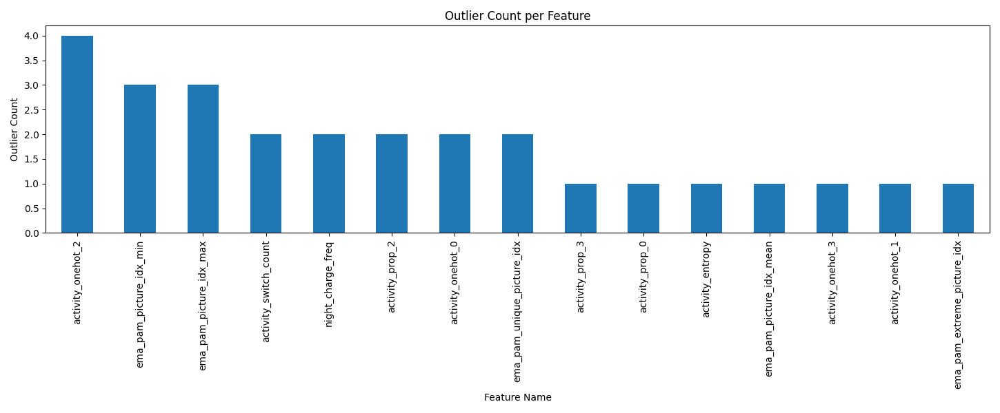

# 特徵異常值偵測報告（自動產生）
本報告統計每個數值型特徵的異常值數量與比例，僅偵測不自動修正。

| 特徵名稱 | 異常值數量 | 異常值比例 |
|----------|----------|----------|
| night_charge_freq | 2 | 6.67% |
| activity_prop_0 | 1 | 3.33% |
| activity_prop_2 | 2 | 6.67% |
| activity_prop_3 | 1 | 3.33% |
| activity_entropy | 1 | 3.33% |
| activity_switch_count | 2 | 6.67% |
| activity_onehot_0 | 2 | 6.67% |
| activity_onehot_1 | 1 | 3.33% |
| activity_onehot_2 | 4 | 13.33% |
| activity_onehot_3 | 1 | 3.33% |
| ema_pam_picture_idx_mean | 1 | 3.33% |
| ema_pam_picture_idx_min | 3 | 10.00% |
| ema_pam_picture_idx_max | 3 | 10.00% |
| ema_pam_extreme_picture_idx | 1 | 3.33% |
| ema_pam_unique_picture_idx | 2 | 6.67% |

